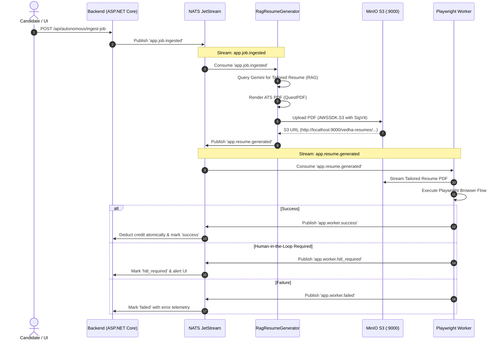

<div align="center">
  
  <h1>Vedha AI — System Architecture</h1>
  <p><strong>Clean Architecture, CQRS, Event-Driven NATS JetStream, and Multi-Pipeline Engineering Blueprint</strong></p>
</div>

---

## 1. High-Level Architecture Overview

Vedha AI is an enterprise-grade AI Career Operating System designed for automated resume tailoring, ATS optimization, semantic job description parsing, multi-pipeline browser application automation, and career tracking. The system follows Clean Architecture principles with CQRS (Command Query Responsibility Segregation), Domain-Driven Design (DDD), and an asynchronous event-driven microservice topology.

```
                      +-------------------------------------------------------+
                      |                   Client Layer                        |
                      |  - React 18/19 + TypeScript + Vite SPA                |
                      |  - Three.js 3D Spatial Constellation Canvas           |
                      |  - Chrome Extension Copilot (Manifest V3)             |
                      +---------------------------+---------------------------+
                                                  | REST API & SignalR WebSockets
                                                  v
                      +-------------------------------------------------------+
                      |             Nginx Ingress / Reverse Proxy             |
                      |  - Dynamic Multi-Gateway DNS Resolver                 |
                      |  - Static SPA Bundles Delivery & Asset Caching        |
                      |  - WebSocket Upgrade Tunnel for SignalR Hubs          |
                      +---------------------------+---------------------------+
                                                  | Port 8080 (Internal Bridge)
                                                  v
                      +-------------------------------------------------------+
                      |              ResumeTailor.WebApi Layer                |
                      |  - Controllers (Tailor, Auth, Storage, Orchestrator)  |
                      |  - SignalR Hub (TailoringProgressHub)                 |
                      |  - JWT Claims Auth & RFC 7807 Exception Middleware   |
                      |  - NatsWorkerEventConsumerHostedService Background    |
                      +---------------------------+---------------------------+
                                                  | MediatR Pipeline
                                                  v
                      +-------------------------------------------------------+
                      |           ResumeTailor.Application Layer              |
                      |  - CQRS Commands & Queries                            |
                      |  - FluentValidation Pipeline Behaviors                |
                      |  - Domain Event Handlers                              |
                      |  - Interfaces (IAiService, IS3Storage, ICrawl4Ai)     |
                      +---------------------------+---------------------------+
                                                  |
                     +----------------------------+----------------------------+
                     |                                                         |
                     v                                                         v
+------------------------------------------+             +------------------------------------------+
|       ResumeTailor.Domain Layer          |             |    ResumeTailor.Infrastructure Layer     |
|  - Domain Entities (MasterResume, User,  |             |  - EF Core & PostgreSQL 16 + pgvector    |
|    GeneratedResume, JobDescription, etc.)|             |  - S3 Storage Service (MinIO + SigV4)    |
|  - Value Objects (ResumeSchema, ATSScore)|             |  - NATS JetStream Publisher & Consumer   |
|  - Enums, Domain Events & Invariants     |             |  - Dual Scrapers (Crawl4AI + AngleSharp) |
|  - Repository Interfaces & Specs         |             |  - QuestPDF Single-Column ATS Generator  |
+------------------------------------------+             |  - Redis 7 Cache & Distributed Locks     |
                                                         +------------------------------------------+
```

---

## 2. Infrastructure & Microservice Topology

All services operate inside a unified bridge network (`infra_vedha-network`), accessible via standard host ports:

```
+---------------------------------------------------------------------------------------+
|  Host Machine (Windows / Linux / macOS)                                               |
|  - Localhost Ports: 3000 (UI/Proxy), 5000 (API), 9000/9001 (S3), 11235 (Crawl4AI)     |
+---------------------------------------------------------------------------------------+
                                          |
                                          v
+---------------------------------------------------------------------------------------+
|  Container Network: infra_vedha-network (Subnet: 10.89.x.x)                           |
|                                                                                       |
|  +--------------------+   +--------------------+   +-------------------------------+  |
|  |   vedha-frontend   |   |   vedha-backend    |   |         vedha-worker          |  |
|  | (Alpine Nginx/SPA) |   | (ASP.NET Core 10)  |   | (Python 3.11 Playwright/NATS) |  |
|  | Port: 3000 (80)    |   | Port: 5000 (8080)  |   | Port: 8000                    |  |
|  +---------+----------+   +---------+----------+   +---------------+---------------+  |
|            |                        |                              |                  |
|            +------------------------+------------------------------+                  |
|                                     |                                                 |
|          +--------------------------+------------------------------+                  |
|          |                          |                              |                  |
|          v                          v                              v                  |
|  +--------------------+   +--------------------+   +-------------------------------+  |
|  |   vedha-postgres   |   |    vedha-redis     |   |          vedha-nats           |  |
|  | (Postgres 16/vec)  |   | (Redis 7 Caching)  |   |    (NATS JetStream Broker)    |  |
|  | Port: 5432         |   | Port: 6379         |   |    Ports: 4222, 8222          |  |
|  +--------------------+   +--------------------+   +-------------------------------+  |
|                                     |                                                 |
|          +--------------------------+------------------------------+                  |
|          |                                                         |                  |
|          v                                                         v                  |
|  +--------------------+                                 +--------------------------+  |
|  |    vedha-minio     |                                 |      vedha-crawler       |  |
|  | (MinIO S3 Storage) |                                 |  (Crawl4AI Anti-Bot API) |  |
|  | Ports: 9000, 9001  |                                 |  Port: 11235             |  |
|  +--------------------+                                 +--------------------------+  |
+---------------------------------------------------------------------------------------+
```

### Services Summary

| Container Name | Internal Port | Host Port | Technology | Purpose |
| :--- | :--- | :--- | :--- | :--- |
| `vedha-frontend` | `80` | `3000` | Nginx Alpine, React 18/19 | Static SPA delivery, reverse proxy for `/api/`, `/health`, `/swagger` |
| `vedha-backend` | `8080` | `5000` | ASP.NET Core 10, C# 13 | Core REST WebAPI, RAG engine, MediatR handlers, S3 controller |
| `vedha-postgres` | `5432` | `5432` | PostgreSQL 16 + pgvector | Relational entities, schema versions, vector embeddings |
| `vedha-redis` | `6379` | `6379` | Redis 7 Alpine | Screening memory cache, distributed locks, session store |
| `vedha-nats` | `4222`, `8222` | `4222`, `8222` | NATS JetStream latest | Decoupled asynchronous event broker (`app.>`) |
| `vedha-minio` | `9000`, `9001` | `9000`, `9001` | MinIO (Chainguard S3) | S3 Object storage (API: 9000, Web Console: 9001) |
| `vedha-crawler` | `11235` | `11235` | Crawl4AI (Python 3.11) | Playwright stealth scraper with dynamic JS accordion unrolling |
| `vedha-worker` | `8000` | `8000` | Python 3.11 + Playwright | Autonomous browser agent for ATS submissions |

---

## 3. End-to-End Event-Driven Application Pipeline

The system uses **NATS JetStream** to decouple intensive AI generation and browser automation from synchronous HTTP request threads:



---

## 4. Layer Responsibilities & Architecture Boundaries

### 4.1 Domain Layer (`ResumeTailor.Domain`)
- **Zero external dependencies**: Contains enterprise business rules, core entities, and value objects.
- Key Entities: `User`, `MasterResume`, `ResumeVersion`, `GeneratedResume`, `JobDescription`, `AtsAnalysis`, `ApplicationRecord`, `ScreeningQuestionMemory`.
- Value Objects: `PersonalInfo`, `WorkExperienceItem`, `ProjectItem`, `EducationItem`, `SkillCategory`, `CertificationItem`, `AchievementItem`, `AtsScoreBreakdown`.

### 4.2 Application Layer (`ResumeTailor.Application`)
- Implements CQRS handlers using MediatR.
- Contains application contracts:
  - `IAiService` & `IAiServiceFactory`: Multi-provider abstraction for Google Gemini, OpenAI, and Anthropic.
  - `ICrawl4AiService` & `IJobScraperService`: Dynamic scraping interfaces.
  - `IS3StorageService`: Object storage contract for resume attachments and exports.
  - `IAtsScoringEngine`: Algorithmic truth preservation and keyword gap analyzer.
  - `INatsPublisher`: Event publication interface.
- Pipeline behaviors handle FluentValidation, telemetry logging, and transaction boundaries.

### 4.3 Infrastructure Layer (`ResumeTailor.Infrastructure`)
- **Dual-Engine Web Scraping**:
  - `Crawl4AiService`: Connects to `vedha-crawler` on port 11235. Uses Playwright stealth mode and automated JS unrolling (`.show-more-less-html__button--more` on LinkedIn, `.styles_jhc__read-more-btn` on Naukri).
  - `JobScraperService`: Primary routing to Crawl4AI; automatic fallback to AngleSharp with custom Readability DOM sanitization if Crawl4AI is offline.
- **S3 Object Storage (`MinioS3StorageService`)**:
  - Official `AWSSDK.S3` AmazonS3Client configured with AWS SigV4 cryptographic signatures.
  - Resilient local disk cache fallback mounted at `/app/s3_local_cache/`.
- **ATS & Truth Invariance Engine (`AtsScoringEngine`)**:
  - Quantitative metric invariance validator extracting and verifying numbers, percentages, and multipliers.
  - Self-healing regex taxonomy covering 60+ industry standards with AI fallback keyword extraction.
- **PDF & Document Rendering**:
  - `QuestPDF`: Single-column ATS typography engine.
  - `PdfPig`: Text stream extraction and column-unwrapping.
  - `DocumentFormat.OpenXml`: Formatted DOCX generation.

### 4.4 Web API Layer (`ResumeTailor.WebApi`)
- ASP.NET Core 10 Web API.
- `TailoringProgressHub`: SignalR WebSocket hub streaming live step telemetry (`Scraping`, `Analyzing`, `Tailoring`, `Scoring`, `Exporting`).
- `StorageController`: Provides authenticated HTTP range request streaming for resume PDFs (`/vedha-resumes/{**key}`).
- `NatsWorkerEventConsumerHostedService`: Background hosted service consuming worker completion and HITL events.

---

## 5. Chrome Extension Architecture (Manifest V3)

The Chrome extension operates as an intelligent browser copilot:

1. **Draggable & Anti-Occlusion Floating Copilot Dock**:
   - Injected into active pages via `#vedha-floating-copilot-root`.
   - Features `manageModalStacking`: MutationObserver scanning for open application dialogs (`[role='dialog']`, `.artdeco-modal`) and elevating them above all overlays (`z-index: 2,147,483,100`).
   - Dock automatically lowers its z-index and collapses to a compact pill whenever a modal opens, guaranteeing 100% clickability of application forms.
2. **Dynamic DOM Question Extraction & AI Grounding**:
   - Inspects active modal steps for unanswered form fields (text, number, textarea, radio group, select).
   - Dispatches batch queries to `POST /api/orchestrator/generate-answers`.
   - Checks `ScreeningQuestionMemory` in Redis/PostgreSQL; queries Google Gemini for novel questions grounded strictly on the candidate's Master Resume.
   - Types answers with human-like Gaussian keystroke jitter (`typeLikeHuman`).

---

## 6. Security & Guardrails

- **Strict "Never Lie" Invariant**: Algorithmic validator prevents LLMs from inventing unverified employers, degrees, certifications, or inflated metric values.
- **AWS SigV4 Authentication**: All S3 operations to MinIO are signed with AWS Signature Version 4.
- **Stateless JWT with Claims Principal**: Authentication uses standard HS256 JWT tokens with RFC 7807 problem details error format.
- **Encrypted Credentials**: External API keys and provider tokens are encrypted at rest using AES-256.

---

## 7. Further Engineering Guides

- [SYSTEM_DESIGN_AND_PATTERNS.md](file:///A:/AIProjects/Resumebuilder/SYSTEM_DESIGN_AND_PATTERNS.md): Complete guide to SOLID principles, CQRS, and enterprise design patterns implemented in this codebase.
- [INTERESTING_THINGS.md](file:///A:/AIProjects/Resumebuilder/INTERESTING_THINGS.md): 18 deep engineering highlights (truth invariants, Crawl4AI anti-bot evasion, biometric jitter, and NATS JetStream pipelines).
