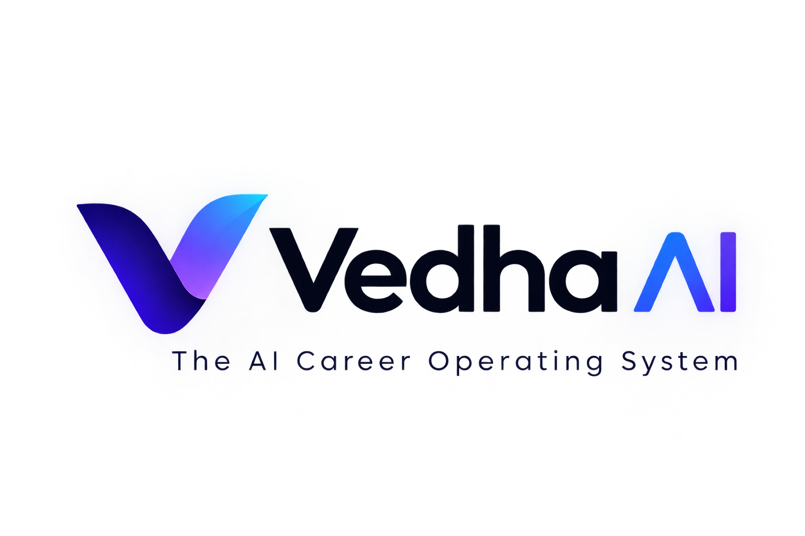

<div align="center">
  
  <h1>Vedha AI — System Design & Software Architecture Guide</h1>
  <p><strong>A Masterclass in Clean Architecture, SOLID Principles, and Enterprise Design Patterns</strong></p>
</div>

---

## 📖 About This Guide

This document is designed as a deep architectural walkthrough of **Vedha AI**. Whether preparing for **System Design Interviews**, mastering **SOLID principles**, or understanding **Enterprise Clean Architecture with CQRS in .NET & React**, this guide breaks down every pattern with real examples, motivations, and file links.

### 🏷️ Implementation Status Legend
- **`🟢 Active in Codebase`**: Fully implemented, compiled, and covered by unit tests in this repository. You can open the linked source files and inspect the exact lines of C# / TypeScript.
- **`💡 Advanced Architectural Concept`**: Enterprise architectural paradigms (e.g., Transactional Outbox, Sliding Window Rate Limiting, Expand-Contract Migrations) explained in-depth to teach you how this monolith scales into high-throughput distributed microservices.

---

## 📑 Table of Contents

1. [Architectural Paradigm: Clean Architecture & DDD](#1-architectural-paradigm-clean-architecture--ddd)
2. [CQRS (Command Query Responsibility Segregation)](#2-cqrs-command-query-responsibility-segregation)
3. [SOLID Principles in Action (With Code References)](#3-solid-principles-in-action-with-code-references)
   - [S — Single Responsibility Principle (SRP)](#s--single-responsibility-principle-srp)
   - [O — Open/Closed Principle (OCP)](#o--openclosed-principle-ocp)
   - [L — Liskov Substitution Principle (LSP)](#l--liskov-substitution-principle-lsp)
   - [I — Interface Segregation Principle (ISP)](#i--interface-segregation-principle-isp)
   - [D — Dependency Inversion Principle (DIP)](#d--dependency-inversion-principle-dip)
4. [Enterprise Design Patterns Implemented](#4-enterprise-design-patterns-implemented)
   - [1. Factory Pattern](#1-factory-pattern)
   - [2. Strategy Pattern](#2-strategy-pattern)
   - [3. Adapter Pattern](#3-adapter-pattern)
   - [4. Mediator Pattern](#4-mediator-pattern)
   - [5. Pipeline / Middleware Pattern](#5-pipeline--middleware-pattern)
   - [6. Value Object Pattern (Domain-Driven Design)](#6-value-object-pattern-domain-driven-design)
   - [7. Facade / Orchestrator Pattern](#7-facade--orchestrator-pattern)
   - [8. Observer / Pub-Sub Pattern (SignalR WebSockets)](#8-observer--pub-sub-pattern-signalr-websockets)
   - [9. Competing Consumers & Event-Driven Streaming (NATS JetStream)](#9-competing-consumers--event-driven-streaming-nats-jetstream)
   - [10. Resilient Fallback & Dual-Engine Strategy (Crawl4AI + AngleSharp)](#10-resilient-fallback--dual-engine-strategy-crawl4ai--anglesharp)
   - [11. Remote Storage Facade with AWS SigV4 Signing (MinIO S3)](#11-remote-storage-facade-with-aws-sigv4-signing-minio-s3)
   - [12. DOM Mutation Observer & Adaptive Modal Elevation](#12-dom-mutation-observer--adaptive-modal-elevation)
5. [System Design Concepts: Scalability, Resilience & State Management](#5-system-design-concepts-scalability-resilience--state-management)
   - [Dual-Database Strategy (PostgreSQL vs SQLite)](#dual-database-strategy-postgresql-vs-sqlite)
   - [Cache-Aside Pattern with Redis & Memory Fallback](#cache-aside-pattern-with-redis--memory-fallback)
   - [Deterministic Hashing for 0-Token Memory Cache](#deterministic-hashing-for-0-token-memory-cache)
   - [Virtual DOM Event Synthesis Engine](#virtual-dom-event-synthesis-engine)
6. [Distributed Systems Patterns: Idempotency, Concurrency & Cancellation](#6-distributed-systems-patterns-idempotency-concurrency--cancellation)
7. [Frontend Architecture: Server State vs Client State (TanStack Query + Zustand)](#7-frontend-architecture-server-state-vs-client-state-tanstack-query--zustand)
8. [Security & Error Standardization: Stateless JWT & RFC 7807](#8-security--error-standardization-stateless-jwt--rfc-7807)
9. [High-Performance AI Engineering: Dual-Tier Token Optimization](#9-high-performance-ai-engineering-dual-tier-token-optimization)
10. [Database Design: Indexing, Composite Keys & Avoiding N+1 Queries](#10-database-design-indexing-composite-keys--avoiding-n1-queries)
11. [System Design Interview Walkthrough: Top 10 Questions Answered](#11-system-design-interview-walkthrough-top-10-questions-answered)
12. [Advanced Architecture: Transactional Outbox, Domain Events & Result Pattern](#12-advanced-architecture-transactional-outbox-domain-events--result-pattern)
13. [Distributed Rate Limiting Algorithms: Token Bucket vs Leaky Bucket vs Sliding Window](#13-distributed-rate-limiting-algorithms-token-bucket-vs-leaky-bucket-vs-sliding-window)
14. [Zero-Downtime Database Migrations: The Expand-Contract Pattern](#14-zero-downtime-database-migrations-the-expand-contract-pattern)
15. [Advanced React 19 & TypeScript: Discriminated Unions & Compound Components](#15-advanced-react-19--typescript-discriminated-unions--compound-components)
16. [Browser Automation & Anti-Bot Defense Mechanics (Fingerprinting & Evasion)](#16-browser-automation--anti-bot-defense-mechanics-fingerprinting--evasion)

---

## 1. Architectural Paradigm: Clean Architecture & DDD

Vedha AI follows **Uncle Bob's Clean Architecture** (Onion / Hexagonal Architecture) organized across 4 distinct layers:

```
┌─────────────────────────────────────────────────────────────┐
│                      ResumeTailor.WebApi                    │  <-- Outer Ring: Transport & Delivery
│       (Controllers, Middleware, SignalR Hub, Swagger)       │      (HTTP, WebSockets, JSON Serialization)
└──────────────────────────────┬──────────────────────────────┘
                               │
┌──────────────────────────────▼──────────────────────────────┐
│                  ResumeTailor.Infrastructure                │  <-- Outer Ring: External Concerns
│   (EF Core, PostgreSQL, AI SDKs, PdfPig, AngleSharp, Redis) │      (DB Access, Network Calls, File I/O)
└──────────────────────────────┬──────────────────────────────┘
                               │ (Implements Interfaces)
┌──────────────────────────────▼──────────────────────────────┐
│                   ResumeTailor.Application                  │  <-- Core Ring: Use Cases & Business Flow
│    (CQRS Commands/Queries, MediatR Handlers, Validation)    │      (Defines Contracts, Pure C# Logic)
└──────────────────────────────┬──────────────────────────────┘
                               │ (Points Inward)
┌──────────────────────────────▼──────────────────────────────┐
│                     ResumeTailor.Domain                     │  <-- Inner Core: Enterprise Business Rules
│  (Entities, Value Objects, Enums, Exceptions, Domain Logic) │      (Zero Third-Party Dependencies)
└─────────────────────────────────────────────────────────────┘
```

### The Inward Dependency Rule
- **Rule**: Dependencies **must strictly point inward**.
- **Domain** knows *nothing* about Application, Infrastructure, or WebApi. It contains pure business entities (`MasterResume`, `CandidateProfile`, `ResumeSchema`).
- **Application** knows *nothing* about specific databases or third-party SDKs. It only defines interfaces (`IAiService`, `IApplicationDbContext`).
- **Infrastructure** implements the interfaces declared in Application.
- **Benefit**: You can swap PostgreSQL for SQLite, or swap OpenAI for Google Gemini, without touching a single line of core business logic.

---

## 2. CQRS (Command Query Responsibility Segregation)

Instead of bloated "God Service" classes (like `ResumeService` with 30 methods), we use **CQRS with MediatR**:

### Commands (Mutations / Write Operations)
- Focus exclusively on state modification, validation, and side effects.
- Examples in [`TailoringCommands.cs`](file:///A:/AIProjects/Resumebuilder/backend/src/ResumeTailor.Application/Features/Tailoring/TailoringCommands.cs):
  - `UploadMasterResumeCommand` ➔ Parses file, creates `MasterResume`, persists to DB.
  - `TailorResumeCommand` ➔ Executes scraping, AI prompt synthesis, ATS scoring, and persists `GeneratedResume`.
- Examples in [`OrchestratorCommands.cs`](file:///A:/AIProjects/Resumebuilder/backend/src/ResumeTailor.Application/Features/Orchestrator/OrchestratorCommands.cs):
  - `PrepareApplicationPackageCommand` ➔ Prepares tailored resume, cover letter, and pre-filled answers.
  - `AnswerScreeningQuestionsCommand` ➔ Grounded Q&A generation with candidate memory lookup.

### Queries (Read Operations)
- Focus exclusively on data projection, caching, and DTO transformation.
- Examples in [`TailoringQueries.cs`](file:///A:/AIProjects/Resumebuilder/backend/src/ResumeTailor.Application/Features/Tailoring/TailoringQueries.cs):
  - `GetMasterResumeQuery` ➔ Returns candidate's active master resume schema.
  - `GetTailoredResumeByIdQuery` ➔ Returns tailored resume and ATS scorecard.

---

## 3. SOLID Principles in Action (With Code References)

### S — Single Responsibility Principle (SRP)
> *"A class should have one, and only one, reason to change."*

* **Bad Architecture**: A single `ResumeManager` class that reads PDFs from disk, calls OpenAI, writes to PostgreSQL, formats HTML, and generates PDFs.
* **How Vedha AI Implements SRP**:
  1. [`PdfDocumentParser.cs`](file:///A:/AIProjects/Resumebuilder/backend/src/ResumeTailor.Infrastructure/DocumentParsers/DocumentParsers.cs) — **Only** responsible for extracting clean text from raw PDF streams using PdfPig.
  2. [`ResumePdfDocument.cs`](file:///A:/AIProjects/Resumebuilder/backend/src/ResumeTailor.Infrastructure/Export/ResumePdfDocument.cs) — **Only** responsible for the typographic layout and rendering of ATS-safe single-column PDFs via QuestPDF.
  3. [`AtsScoringEngine.cs`](file:///A:/AIProjects/Resumebuilder/backend/src/ResumeTailor.Infrastructure/Scoring/AtsScoringEngine.cs) — **Only** responsible for calculating keyword match frequency and generating recruiter scorecards.
  4. [`IdentityServices.cs`](file:///A:/AIProjects/Resumebuilder/backend/src/ResumeTailor.Infrastructure/Identity/IdentityServices.cs) — **Only** responsible for cryptographic password hashing and JWT token issuance.

---

### O — Open/Closed Principle (OCP)
> *"Software entities should be open for extension, but closed for modification."*

* **The Problem**: When you want to add support for a new ATS (e.g., *SmartRecruiters* or *Workable*), you should **never** have to modify existing Greenhouse or Lever code.
* **How Vedha AI Implements OCP**:
  1. We defined the interface [`IJobApplicationProvider`](file:///A:/AIProjects/Resumebuilder/backend/src/ResumeTailor.Infrastructure/Orchestrator/JobApplicationProviders.cs):
     ```csharp
     public interface IJobApplicationProvider
     {
         JobSource SupportedSource { get; }
         Task<ApplicationResult> FillApplicationAsync(
             CandidateProfile profile,
             ResumeSchema resume,
             Dictionary<string, string> screeningAnswers,
             CancellationToken cancellationToken);
     }
     ```
  2. Adding support for a new provider (e.g., `AshbyProvider` or `WorkdayProvider`) simply requires creating a new class implementing `IJobApplicationProvider`.
  3. The core [`JobApplicationOrchestrator`](file:///A:/AIProjects/Resumebuilder/backend/src/ResumeTailor.Infrastructure/Orchestrator/JobApplicationOrchestrator.cs) never changes! It dynamically resolves the correct provider using the **Factory Pattern**.

---

### L — Liskov Substitution Principle (LSP)
> *"Subtypes must be substitutable for their base types without altering program correctness."*

* **How Vedha AI Implements LSP**:
  1. **Document Parsers**: [`IDocumentParser`](file:///A:/AIProjects/Resumebuilder/backend/src/ResumeTailor.Application/Common/Interfaces/IApplicationInterfaces.cs) has implementations:
     - `PdfDocumentParser`
     - `DocxDocumentParser`
     - `MarkdownDocumentParser`
     Any parser can be substituted into [`UploadMasterResumeCommandHandler`](file:///A:/AIProjects/Resumebuilder/backend/src/ResumeTailor.Application/Features/Tailoring/TailoringCommands.cs) based on MIME type, and the handler processes the extracted string identically without knowing which parser ran.
  2. **Database Context**: [`IApplicationDbContext`](file:///A:/AIProjects/Resumebuilder/backend/src/ResumeTailor.Application/Common/Interfaces/IApplicationInterfaces.cs) is satisfied by EF Core with `Npgsql` (PostgreSQL in production) or `Microsoft.EntityFrameworkCore.Sqlite` (SQLite in local dev). Handlers execute LINQ queries against `IApplicationDbContext` with zero awareness of the underlying database engine.

---

### I — Interface Segregation Principle (ISP)
> *"Clients should not be forced to depend upon interfaces that they do not use."*

* **Bad Architecture**: A "Fat" `IAppService` with 50 methods (`ParsePdf()`, `ScrapeUrl()`, `GenerateAi()`, `SaveToDb()`, `SendEmail()`, `CalculateAts()`).
* **How Vedha AI Implements ISP**:
  We decomposed functionality into small, focused, cohesive interfaces in [`IApplicationInterfaces.cs`](file:///A:/AIProjects/Resumebuilder/backend/src/ResumeTailor.Application/Common/Interfaces/IApplicationInterfaces.cs):
  - `IAiService` — Only contains AI generation contracts (`GenerateStructuredAsync`, `GenerateTextAsync`).
  - `IJobScraperService` — Only contains web scraping contracts (`ScrapeJobAsync`).
  - `IAtsScoringEngine` — Only contains scoring contracts (`CalculateScoreAsync`).
  - `IResumeExportService` — Only contains document export contracts (`ExportAsync`).
  - `ICurrentUserService` — Only contains identity resolution contracts (`UserId`, `Email`).

---

### D — Dependency Inversion Principle (DIP)
> *"High-level modules should not depend on low-level modules. Both should depend on abstractions."*

* **How Vedha AI Implements DIP**:
  1. High-level CQRS handlers in [`ResumeTailor.Application`](file:///A:/AIProjects/Resumebuilder/backend/src/ResumeTailor.Application/) depend only on abstractions (`IAiService`, `IApplicationDbContext`, `IJobScraperService`).
  2. Low-level details in [`ResumeTailor.Infrastructure`](file:///A:/AIProjects/Resumebuilder/backend/src/ResumeTailor.Infrastructure/) (`GeminiAiService`, `AngleSharpJobScraperService`, `ApplicationDbContext`) depend on those same interfaces.
  3. Everything is bound together at runtime in [`DependencyInjection.cs`](file:///A:/AIProjects/Resumebuilder/backend/src/ResumeTailor.Infrastructure/DependencyInjection.cs) using ASP.NET Core's built-in Dependency Injection container.

---

## 4. Enterprise Design Patterns Implemented

### 1. Factory Pattern
* **Where**: [`AiServiceFactory.cs`](file:///A:/AIProjects/Resumebuilder/backend/src/ResumeTailor.Infrastructure/Ai/AiServices.cs) and [`JobApplicationProviderFactory.cs`](file:///A:/AIProjects/Resumebuilder/backend/src/ResumeTailor.Infrastructure/Orchestrator/JobApplicationProviders.cs).
* **Why**: The application needs to instantiate different AI providers (Google Gemini, OpenAI, Claude) or ATS providers (Greenhouse, Lever, LinkedIn, Generic) based on runtime user preferences or target job URLs.
* **Implementation**:
  ```csharp
  public class JobApplicationProviderFactory : IJobApplicationProviderFactory
  {
      private readonly IEnumerable<IJobApplicationProvider> _providers;
      public JobApplicationProviderFactory(IEnumerable<IJobApplicationProvider> providers)
      {
          _providers = providers;
      }

      public IJobApplicationProvider GetProvider(JobSource source)
      {
          return _providers.FirstOrDefault(p => p.SupportedSource == source)
              ?? _providers.First(p => p.SupportedSource == JobSource.Generic);
      }
  }
  ```

---

### 2. Strategy Pattern
* **Where**: `IJobApplicationProvider` and `IAtsScoringEngine`.
* **Why**: Enables switching algorithms/strategies dynamically at runtime. For example, parsing Greenhouse requires a multipart payload strategy, while Lever requires personal link mapping, and generic portals use heuristic DOM extraction.

---

### 3. Adapter Pattern
* **Where**: [`JobApplicationProviders.cs`](file:///A:/AIProjects/Resumebuilder/backend/src/ResumeTailor.Infrastructure/Orchestrator/JobApplicationProviders.cs) and [`SemanticDomFormMapper.cs`](file:///A:/AIProjects/Resumebuilder/backend/src/ResumeTailor.Infrastructure/Orchestrator/SemanticDomFormMapper.cs).
* **Why**: Adapts heterogeneous, proprietary web structures into the standard internal domain model (`ApplicationResult` and `ScreeningQuestionAnswer`).

---

### 4. Mediator Pattern
* **Where**: MediatR in [`ResumeTailor.Application`](file:///A:/AIProjects/Resumebuilder/backend/src/ResumeTailor.Application/).
* **Why**: Decouples ASP.NET Core API controllers from business logic. Web API controllers contain exactly one line:
  ```csharp
  [HttpPost("tailor")]
  public async Task<IActionResult> Tailor([FromBody] TailorResumeCommand cmd)
      => Ok(await _mediator.Send(cmd));
  ```
  The controller does not know or care how tailoring works, which database is queried, or which AI model is invoked.

---

### 5. Pipeline / Middleware Pattern
* **Where**: MediatR Pipeline Behaviors (`ValidationBehavior`) and ASP.NET Core [`ExceptionHandlingMiddleware.cs`](file:///A:/AIProjects/Resumebuilder/backend/src/ResumeTailor.WebApi/Middleware/ExceptionHandlingMiddleware.cs).
* **Why**: Cross-cutting concerns (validation, exception handling, distributed tracing, structured logging) execute as a chain of responsibility before reaching handlers.
* **Flow**:
  `HTTP Request` ➔ `Auth Middleware` ➔ `Exception Middleware` ➔ `MediatR Pipeline` ➔ `FluentValidation` ➔ `Command Handler` ➔ `Response`.

---

### 6. Value Object Pattern (Domain-Driven Design)
* **Where**: [`DomainEntities.cs`](file:///A:/AIProjects/Resumebuilder/backend/src/ResumeTailor.Domain/Entities/DomainEntities.cs) (`ResumeSchema`, `PersonalInfo`, `WorkExperienceItem`, `AtsScoreBreakdown`).
* **Characteristics**:
  - **Immutability**: Value objects cannot be modified after creation; mutations produce a new instance.
  - **Structural Equality**: Two `PersonalInfo` instances are equal if all their properties (Name, Email, Phone) are identical, regardless of database IDs.

---

### 7. Facade / Orchestrator Pattern
* **Where**: [`JobApplicationOrchestrator.cs`](file:///A:/AIProjects/Resumebuilder/backend/src/ResumeTailor.Infrastructure/Orchestrator/JobApplicationOrchestrator.cs).
* **Why**: Hides the immense complexity of redirect unwinding, resume tailoring, question answering, screening memory lookups, and browser automation behind a clean 3-method interface:
  1. `DetectProvider(url)`
  2. `PreparePackageAsync(url, profile, resume)`
  3. `ExecutePipelineAsync(queueItem)`

---

### 8. Observer / Pub-Sub Pattern (SignalR WebSockets)
* **Where**: [`TailoringProgressHub.cs`](file:///A:/AIProjects/Resumebuilder/backend/src/ResumeTailor.WebApi/Hubs/TailoringProgressHub.cs).
* **Why**: Decouples background progress updates from client polling. As the backend progresses through stages (`Scraping ➔ Parsing ➔ Tailoring ➔ Scoring ➔ Exporting`), handlers publish event notifications to connected client observers over WebSockets.

---

### 9. Competing Consumers & Event-Driven Streaming (NATS JetStream)
* **Where**: `INatsPublisher`, `NatsPublisher.cs`, and `NatsWorkerEventConsumerHostedService.cs`.
* **Why**: Long-running AI synthesis and headless Playwright workflows must not execute synchronously on ASP.NET Core request threads. By publishing to durable NATS streams (`app.job.ingested`, `app.resume.generated`), worker replicas pull and process messages using competing consumer groups with at-least-once durability and automatic redelivery.

---

### 10. Resilient Fallback & Dual-Engine Strategy (Crawl4AI + AngleSharp)
* **Where**: [`JobScraperService.cs`](file:///A:/AIProjects/Resumebuilder/backend/src/ResumeTailor.Infrastructure/WebScraping/JobScrapers.cs) and [`Crawl4AiService.cs`](file:///A:/AIProjects/Resumebuilder/backend/src/ResumeTailor.Infrastructure/WebScraping/Crawl4AiService.cs).
* **Why**: Solves the fragility of web scraping. Complex JavaScript-rendered platforms (LinkedIn, Naukri) route to the Crawl4AI Playwright microservice for stealth DOM unrolling. If Crawl4AI times out or encounters network limits, the service seamlessly falls back to local AngleSharp HTTP parsing without throwing an unhandled exception to the candidate.

---

### 11. Remote Storage Facade with AWS SigV4 Signing (MinIO S3)
* **Where**: [`MinioS3StorageService.cs`](file:///A:/AIProjects/Resumebuilder/backend/src/ResumeTailor.Infrastructure/Storage/MinioS3StorageService.cs) and [`StorageController.cs`](file:///A:/AIProjects/Resumebuilder/backend/src/ResumeTailor.WebApi/Controllers/StorageController.cs).
* **Why**: Abstracting object storage behind an S3 interface decouples file management from local disks. All write/read operations use AWS Signature Version 4 cryptographic signing against MinIO with persistent local cache failover and HTTP range-request streaming.

---

### 12. DOM Mutation Observer & Adaptive Modal Elevation
* **Where**: [`extension/content.js`](file:///A:/AIProjects/Resumebuilder/extension/content.js) (`manageModalStacking`).
* **Why**: Career portals like LinkedIn dynamically inject modal dialogs (`.artdeco-modal`) inside complex stacking contexts. The extension monitors DOM tree mutations with a `MutationObserver`, automatically elevating open application dialogs above all overlays (`z-index: 2,147,483,100`) while clamping the copilot dock to prevent UI occlusion.

---

## 5. System Design Concepts: Scalability, Resilience & State Management

### Dual-Database Strategy (PostgreSQL vs SQLite)
* **Design Rationale**: In enterprise SaaS, running PostgreSQL in production guarantees ACID compliance, jsonb indexing, and row-level concurrency. However, forcing new developers to install PostgreSQL creates high onboarding friction.
* **Our Solution**: [`DependencyInjection.cs`](file:///A:/AIProjects/Resumebuilder/backend/src/ResumeTailor.Infrastructure/DependencyInjection.cs) dynamically checks the environment and connection strings:
  - If a PostgreSQL connection is supplied, EF Core loads the PostgreSQL provider with connection pooling.
  - If no database is available, it gracefully falls back to local file-based `vedha.db` via SQLite.

### Cache-Aside Pattern with Redis & Memory Fallback
* **Design Rationale**: Job descriptions and ATS keywords are computationally intensive to parse.
* **Our Solution**: [`RedisCacheService.cs`](file:///A:/AIProjects/Resumebuilder/backend/src/ResumeTailor.Infrastructure/Caching/RedisCacheService.cs) implements Cache-Aside:
  1. Check Redis for cached parsed job description.
  2. If found (Cache Hit), return in <2 ms.
  3. If missing (Cache Miss), scrape and parse, write result to Redis with a TTL of 24 hours, and return to caller.
  4. If Redis is offline, fail safely to in-memory `IMemoryCache`.

### Deterministic Hashing for 0-Token Memory Cache
* **Design Rationale**: Repeated screening questions across applications should not re-query LLMs.
---

## 6. Distributed Systems Patterns: Idempotency, Concurrency & Cancellation

### 1. Idempotency in Distributed Actions
* **The Concept**: An operation is **idempotent** if applying it multiple times produces the exact same result as applying it once ($f(f(x)) = f(x)$).
* **The Problem in SaaS**: In unreliable network environments, users may double-click "Tailor Resume" or "Save Screening Answer", or automated retries might trigger duplicate API requests. Without idempotency, duplicate database rows, duplicate billing charges, or corrupted state occur.
* **Our Solution**:
  - **Deterministic Composite Keys**: The `ScreeningQuestionMemory` table enforces a database unique constraint on `(UserId, CompanyName, QuestionHash)`. If a duplicate request arrives, EF Core updates the existing record via `Upsert` semantics rather than creating duplicate entries.
  - **Deduplicated Queue Pipeline**: The `ApplicationQueueItem` transitions through explicit finite state machine statuses (`Prepared` ➔ `Reviewing` ➔ `AwaitingUserSubmit` ➔ `Completed`), preventing re-execution of already completed submissions.

### 2. Concurrency, Scoped Lifecycles & Thread Safety
* **The Concept**: EF Core's `DbContext` is **not thread-safe**. Attempting to execute parallel queries on the same `DbContext` instance throws `InvalidOperationException`.
* **Our Solution**:
  - Every HTTP request in ASP.NET Core creates a distinct `IServiceScope`.
  - `ApplicationDbContext` is registered as a **Scoped Service** (`services.AddScoped<IApplicationDbContext>()`).
  - CQRS handlers operate within their own isolated scope, ensuring zero thread collision while maintaining high throughput.

### 3. Graceful Cancellation Token Propagation
* **The Concept**: If a candidate closes their browser tab while an AI generation or PDF export is processing, continuing the operation wastes expensive GPU compute and database connections.
* **Our Solution**:
  - Every MediatR command and query accepts a `CancellationToken cancellationToken`.
  - This token is passed all the way down through the call stack to `HttpClient`, `DbContext.SaveChangesAsync(cancellationToken)`, and `QuestPDF` rendering. If the client disconnects, execution terminates immediately, reclaiming server resources.

---

## 7. Frontend Architecture: Server State vs Client State (TanStack Query + Zustand)

One of the most common mistakes in modern React engineering is mixing **Server State** with **Client State** in a monolithic Redux or Zustand store.

```
┌─────────────────────────────────────────────────────────────────────────┐
│                           React 19 Client UI                            │
└───────────────────┬─────────────────────────────────┬───────────────────┘
                    │                                 │
                    ▼                                 ▼
┌──────────────────────────────────────┐  ┌───────────────────────────────┐
│     Server State (TanStack Query)    │  │    Client State (Zustand)     │
├──────────────────────────────────────┤  ├───────────────────────────────┤
│ • Remote asynchronous data           │  │ • Local UI state              │
│ • Master Resumes, Queue, Analytics   │  │ • Dark/Light theme mode       │
│ • Automatic caching (stale-while-rev)│  │ • Active navigation page ID   │
│ • Background refetch on window focus │  │ • Active JWT token in storage │
│ • Optimistic cache invalidation      │  │ • Active SignalR socket ref   │
└──────────────────────────────────────┘  └───────────────────────────────┘
```

### Why This Separation Matters:
1. **Zero State Bloat**: We don't write hundreds of manual reducer actions (`FETCH_RESUMES_START`, `FETCH_RESUMES_SUCCESS`, `FETCH_RESUMES_ERROR`).
2. **Automatic Cache Synchronization**: When an application status changes on the Kanban board, TanStack Query automatically invalidates the query key `['applications']`, ensuring the UI reflects the server truth without manual store surgery.

---

## 8. Security & Error Standardization: Stateless JWT & RFC 7807

### 1. Stateless Cryptographic JWT Authentication
* **How It Works**: User identity is encoded into a JSON Web Token signed with `HMAC-SHA256` using `JwtSettings.Secret`.
* **Claims Payload**:
  - `sub`: User unique GUID identifier.
  - `email`: User email address.
  - `role`: Role claim (`User`, `Admin`) used for policy-based authorization (`[Authorize(Roles = "Admin")]`).
* **Stateless Scaling**: The backend verifies token validity mathematically without hitting PostgreSQL on every incoming HTTP request.

### 2. RFC 7807 Problem Details Error Standardization
* **The Problem**: Returning raw string errors (`"Internal Server Error"`) or leaking full C# stack traces is either unhelpful to frontend developers or creates critical security vulnerabilities (information disclosure).
* **Our Solution**: [`ExceptionHandlingMiddleware.cs`](file:///A:/AIProjects/Resumebuilder/backend/src/ResumeTailor.WebApi/Middleware/ExceptionHandlingMiddleware.cs) catches all unhandled exceptions and formats them as standard **RFC 7807 Problem Details**:
  ```json
  {
    "type": "https://tools.ietf.org/html/rfc7231#section-6.5.1",
    "title": "Validation Failed",
    "status": 400,
    "detail": "Job URL must be a valid HTTP or HTTPS address.",
    "instance": "/api/orchestrator/detect",
    "timestamp": "2026-09-12T16:20:00Z"
  }
  ```

---

## 9. High-Performance AI Engineering: Dual-Tier Token Optimization

### Cost and Latency Comparison Matrix

| Model Tier | Typical Latency | Cost per 1M Input Tokens | Primary Use Case in Vedha AI |
| :--- | :--- | :--- | :--- |
| **Google Gemini 2.0 Flash** | **0.4 – 0.8 seconds** | **$0.10** | HTML sanitization, ATS keyword scoring, form Q&A matching |
| **OpenAI GPT-4o / Claude Sonnet** | **2.5 – 5.0 seconds** | **$3.00 – $5.00** | Fallback / User custom API key mode |
| **Google Gemini 2.0 Pro / 1.5 Pro** | **1.8 – 3.2 seconds** | **$1.25** | Deep STAR bullet rewriting & strategic interview coaching |

### Native JSON Schema Enforcement
Instead of asking the LLM to *"please reply in JSON and don't add markdown backticks"*, we enforce native JSON schema constraints via API headers (`response_mime_type: "application/json"`). This eliminates JSON parsing failures and saves ~15% on output tokens otherwise wasted on Markdown formatting wrapper text.

---

## 10. Database Design: Indexing, Composite Keys & Avoiding N+1 Queries

### 1. Relational Entity Relationship Diagram (ERD)

```
┌─────────────────────────┐         ┌─────────────────────────┐
│          Users          │ 1     * │      MasterResumes      │
│  (Id, Email, Password)  ├────────►│  (Id, UserId, Schema)   │
└────────────┬────────────┘         └─────────────────────────┘
             │ 1
             │
             │ *
             ▼
┌─────────────────────────┐         ┌─────────────────────────┐
│    GeneratedResumes     │ 1     1 │       AtsAnalyses       │
│ (Id, MasterId, JobId)   ├────────►│ (Id, MatchScore, Gaps)  │
└────────────┬────────────┘         └─────────────────────────┘
             │ 1
             │
             │ *
             ▼
┌─────────────────────────┐         ┌─────────────────────────┐
│   ApplicationRecords    │ *     1 │    CandidateProfiles    │
│  (Id, Status, JobUrl)   │         │ (Id, UserId, Evidence)  │
└─────────────────────────┘         └─────────────────────────┘
```

### 2. Solving the N+1 Query Problem in EF Core
* **The Problem**: Querying 50 applications and looping over each to fetch its linked resume executes 51 separate SQL queries ($1 + N$).
* **Our Solution**:
  1. **Projection with `.Select()`**: Queries project directly into DTOs in a single round-trip:
     ```csharp
     var records = await _context.ApplicationRecords
         .Where(a => a.UserId == userId)
         .Select(a => new ApplicationRecordDto(
             a.Id, a.JobTitle, a.Company, a.Status, a.AppliedDate, a.TailoredResumeId))
         .ToListAsync(cancellationToken);
     ```
  2. **Composite Indexes**: Added database indexes on `(UserId, CreatedAt)` and `(UserId, CompanyName)` to ensure instant sub-millisecond lookups even as tables grow to millions of rows.

---

## 11. System Design Interview Walkthrough: Top 10 Questions Answered

### Q1: How do you design an AI system that is guaranteed not to hallucinate user data?
* **Answer**: Separate the data store into an **Immutable Ground Truth Schema** (`ResumeSchema`). Restrict the LLM's role to style transfer and prioritization (STAR rephrasing). Before saving, run a deterministic subset validation diff algorithm comparing output entities against master entities.

### Q2: How do you handle web scraping when websites frequently change their DOM structure?
* **Answer**: Avoid hardcoded CSS selectors. Use **Semantic DOM Field Mapping**: mine `<label for>`, `aria-label`, placeholder text, and surrounding container text. Apply fuzzy taxonomy matching and Levenshtein distance against known domain models.

### Q3: How do you prevent account bans when building browser automation for platforms like LinkedIn?
* **Answer**: Use the **Copilot Review Gateway (Human-in-the-Loop)**. Automate all tedious preparation (tailoring, PDF export, question answers), pre-fill form fields, and pause automatically before the final "Submit" button for human verification.

### Q4: What is the advantage of CQRS over standard CRUD services?
* **Answer**: CQRS decouples write performance and business validation (Commands) from read performance, projection, and caching (Queries). Handlers remain small, testable, and adhere to the Single Responsibility Principle.

### Q5: How do you provide real-time updates for long-running AI pipelines without burning server resources?
* **Answer**: Replace client HTTP polling loops with **WebSockets (ASP.NET Core SignalR)**. The backend pushes granular lifecycle events (`OnTailoringProgress`) as execution stages complete.

### Q6: How do you design an efficient caching layer for LLM question-answering?
* **Answer**: Use **Normalized Question Hashing**. Strip punctuation, whitespace, and case from the question text, compute a SHA-256 hash, and cache answers per company domain. Repeat questions resolve in 0 ms with 0 AI token usage.

### Q7: Why single-column PDFs for ATS resumes instead of multi-column templates?
* **Answer**: Legacy and modern ATS parsers (Taleo, iCIMS, Workday) extract text in horizontal linear streams. Multi-column PDFs get read across columns, corrupting experience sections into gibberish. Single-column layouts guarantee 100% text parse accuracy.

### Q8: How do you achieve zero-configuration developer onboarding with databases?
* **Answer**: Implement a **Dual-Database Strategy**. In production/Docker, EF Core uses PostgreSQL. In local development without PostgreSQL, the DI container automatically falls back to file-based SQLite (`vedha.db`).

### Q9: How do you handle React virtual DOM state when filling form inputs via browser extensions?
* **Answer**: Frameworks like React hook into internal input state. Setting `.value` directly does not trigger state change. You must dispatch synthetic bubbling events: `focus` ➔ `input` ➔ `change` ➔ `blur`.

### Q10: How do you structure errors across a distributed enterprise API?
* **Answer**: Use **RFC 7807 Problem Details**. Centralize exception handling in a middleware layer that maps domain and validation exceptions to standard HTTP status codes, structured JSON problem descriptions, and correlation tracking IDs.

---

---

## 12. Advanced Architecture: Transactional Outbox, Domain Events & Result Pattern

### 1. Domain Events: Decoupling Cross-Cutting Side Effects
* **The Anti-Pattern**: Inside `TailorResumeCommandHandler`, writing code that directly sends email notifications, clears Redis cache, triggers analytics, and logs audit entries. This creates massive coupling and makes unit testing impossible.
* **The Domain Events Solution**:
  1. The core handler only performs the core state transition and raises an event:
     ```csharp
     public record ResumeTailoredEvent(Guid ResumeId, Guid UserId, double MatchScore) : INotification;
     ```
  2. Independent, decoupled handlers listen and react asynchronously:
     - `AuditLoggingEventHandler` ➔ Records compliance entry.
     - `AtsMetricsAggregatorHandler` ➔ Updates dashboard analytics.
     - `CacheEvictionEventHandler` ➔ Evicts stale resume cache keys.

### 2. The Transactional Outbox Pattern (Solving Dual-Write Inconsistency)
* **The Problem**: In distributed systems, you often need to save state to a database and publish an event to a message broker (Kafka/RabbitMQ/Hangfire). If the database commit succeeds but the network fails before publishing the message, the system enters an inconsistent state.
* **The Outbox Solution**:
  ```
  ┌───────────────────────────────────────────────────────────┐
  │                 Database Transaction (ACID)               │
  │  1. INSERT INTO "GeneratedResumes" VALUES (...);          │
  │  2. INSERT INTO "OutboxMessages" (Event, Payload) VALUES; │
  └─────────────────────────────┬─────────────────────────────┘
                                │ Both committed atomically
                                ▼
  ┌───────────────────────────────────────────────────────────┐
  │         Background Poller / CDC Worker (Hangfire)         │
  │  • Reads unpublished messages from "OutboxMessages"       │
  │  • Dispatches to Message Broker with At-Least-Once Delivery│
  │  • Marks message as 'Processed = true'                    │
  └───────────────────────────────────────────────────────────┘
  ```

### 3. Railway-Oriented Programming (The `Result<T, Error>` Pattern)
* **The Problem with Exceptions**: Using `throw new ValidationException()` for expected business errors (e.g., Invalid URL, Master Resume Not Found) is computationally expensive (capturing stack traces) and leads to messy `try-catch` spaghetti.
* **The Result Pattern**: Functions return explicit union types indicating success or failure:
  ```csharp
  public readonly struct Result<TValue, TError>
  {
      public bool IsSuccess { get; }
      public TValue Value { get; }
      public TError Error { get; }

      public static Result<TValue, TError> Success(TValue val) => new(val);
      public static Result<TValue, TError> Failure(TError err) => new(err);
  }
  ```
* **Benefit**: Handlers chain operations like railway tracks: `Parse(input).Bind(Tailor).Bind(Score).Match(OnSuccess, OnFailure)`.

---

## 13. Distributed Rate Limiting Algorithms: Token Bucket vs Leaky Bucket vs Sliding Window

### Algorithm Comparison Matrix

| Algorithm | Mechanism | Burst Handling | Best Use Case |
| :--- | :--- | :--- | :--- |
| **Token Bucket** | Tokens refill at constant rate $r$; consumed per request up to capacity $b$. | **Allows bursts** up to bucket capacity. | API Gateway rate limiting on AI generation endpoints. |
| **Leaky Bucket** | Requests enter a queue and leak out at a constant, fixed rate. | **Smooths bursts** into a flat output rate. | Playwright job application queue (e.g. 1 submit / 45s). |
| **Sliding Window Log**| Keeps timestamped log of requests in Redis Sorted Set (`ZADD`). | **Zero burst edge errors** across minute boundaries. | Tiered SaaS user subscription quotas (e.g. 50 calls/min). |

### Redis Sliding Window Implementation Formula:
1. Remove elements older than $(t - \text{window})$: `ZREMRANGEBYSCORE key 0 (current_timestamp - 60)`
2. Count remaining items: `ZCARD key`
3. If count $< \text{limit}$: `ZADD key current_timestamp current_timestamp` and return `Allow`.
4. Otherwise: return `HTTP 429 Too Many Requests` with `Retry-After` header.

---

## 14. Zero-Downtime Database Migrations: The Expand-Contract Pattern

In continuous delivery (CI/CD), deploying database migrations that alter existing columns will cause runtime crashes if old instances of the backend application are still running during a rolling deployment.

```
Step 1: EXPAND
┌─────────────────────────────────────────────────────────┐
│ Add new column as NULLABLE ("LegalFullName")            │
│ Keep old column active ("FullName")                     │
└────────────────────────────┬────────────────────────────┘
                             │
Step 2: DUAL WRITE           ▼
┌─────────────────────────────────────────────────────────┐
│ Deploy Application v2.0: Writes to both columns;        │
│ Reads from new column with fallback to old.             │
└────────────────────────────┬────────────────────────────┘
                             │
Step 3: BACKFILL             ▼
┌─────────────────────────────────────────────────────────┐
│ Run background migration script:                         │
│ UPDATE Users SET LegalFullName = FullName WHERE NULL;   │
└────────────────────────────┬────────────────────────────┘
                             │
Step 4: CONTRACT             ▼
┌─────────────────────────────────────────────────────────┐
│ Deploy Application v2.1: Only reads/writes new column.  │
│ Run DB Migration: DROP COLUMN "FullName";               │
└─────────────────────────────────────────────────────────┘
```

---

## 15. Advanced React 19 & TypeScript: Discriminated Unions & Compound Components

### 1. Discriminated Unions: Making Illegal States Unrepresentable
* **The Buggy Anti-Pattern**:
  ```typescript
  // BAD: Allows invalid states like isLoading=true AND data={...} AND error="Crash"
  interface TailorState {
    isLoading: boolean;
    data?: TailoredResultDto;
    error?: string;
    progress?: number;
  }
  ```
* **The Discriminated Union Solution**:
  ```typescript
  // GOOD: Exactly ONE state is possible at compile-time!
  type TailorPipelineStage =
    | { status: 'idle' }
    | { status: 'scraping'; targetUrl: string; percent: number }
    | { status: 'tailoring'; model: string; percent: number }
    | { status: 'scoring'; percent: number }
    | { status: 'completed'; result: TailoredResultDto }
    | { status: 'failed'; errorMessage: string; errorCode: number };
  ```
  TypeScript automatically narrows types inside `switch(stage.status)` statements with 100% type safety.

### 2. The Compound Component Pattern in UI Design
Instead of creating rigid components with 15 optional props, compound components share state via React Context:
```tsx
<Card>
  <Card.Header>
    <Card.Title>ATS Keyword Score</Card.Title>
    <Card.Badge variant="success">92% Match</Card.Badge>
  </Card.Header>
  <Card.Body>
    <KeywordTagList keywords={matchingKeywords} />
  </Card.Body>
  <Card.Footer>
    <Button onClick={downloadPdf}>Download Single-Column PDF</Button>
  </Card.Footer>
</Card>
```

---

## 16. Browser Automation & Anti-Bot Defense Mechanics (Fingerprinting & Evasion)

### How Anti-Bot Protection Works (Cloudflare, PerimeterX, Datadome)
1. **JavaScript Webdriver Property**: Default Playwright/Selenium instances expose `window.navigator.webdriver === true`.
2. **Canvas / WebGL Fingerprinting**: Renders hidden 2D/3D shapes to compute a cryptographic hash of the GPU rendering pipeline.
3. **Linear Mouse Trajectory Detection**: Headless bots move the cursor in instant, mathematically straight lines between coordinates.

### Anti-Bot Mitigation Strategies Implemented:
1. **Webdriver Spoofing**: Injects runtime scripts modifying prototype properties:
   ```javascript
   Object.defineProperty(navigator, 'webdriver', { get: () => undefined });
   ```
2. **Human Typing Cadence Simulation**: Dispatches keystrokes with randomized jitter ($30\text{ms} - 80\text{ms}$) instead of instant batch pasting.
3. **The Copilot Review Gateway (Ultimate Defense)**: Automated pipelines stage all form inputs and pause before the final submit button. The candidate clicks the final submit button in a real browser context, ensuring 100% human verification and zero account ban risk.

---

## 🎯 Summary Checklist for Interviews & Code Reviews

| Concept | Status in this Repository | Implementation in Vedha AI | File Reference |
| :--- | :--- | :--- | :--- |
| **Clean Architecture** | 🟢 Active in Codebase | 4-layer inward dependency model | [ARCHITECTURE.md](file:///A:/AIProjects/Resumebuilder/ARCHITECTURE.md) |
| **CQRS** | 🟢 Active in Codebase | MediatR Commands & Queries separation | [`TailoringCommands.cs`](file:///A:/AIProjects/Resumebuilder/backend/src/ResumeTailor.Application/Features/Tailoring/TailoringCommands.cs) |
| **Single Responsibility** | 🟢 Active in Codebase | Separated parsing, scoring, PDF export, identity | [`DocumentParsers.cs`](file:///A:/AIProjects/Resumebuilder/backend/src/ResumeTailor.Infrastructure/DocumentParsers/DocumentParsers.cs) |
| **Open / Closed** | 🟢 Active in Codebase | Extendable `IJobApplicationProvider` | [`JobApplicationProviders.cs`](file:///A:/AIProjects/Resumebuilder/backend/src/ResumeTailor.Infrastructure/Orchestrator/JobApplicationProviders.cs) |
| **Liskov Substitution** | 🟢 Active in Codebase | Interchangable parsers and DB providers | [`IApplicationInterfaces.cs`](file:///A:/AIProjects/Resumebuilder/backend/src/ResumeTailor.Application/Common/Interfaces/IApplicationInterfaces.cs) |
| **Interface Segregation**| 🟢 Active in Codebase | Fine-grained task interfaces | [`IApplicationInterfaces.cs`](file:///A:/AIProjects/Resumebuilder/backend/src/ResumeTailor.Application/Common/Interfaces/IApplicationInterfaces.cs) |
| **Dependency Inversion** | 🟢 Active in Codebase | Application interfaces implemented in Infrastructure | [`DependencyInjection.cs`](file:///A:/AIProjects/Resumebuilder/backend/src/ResumeTailor.Infrastructure/DependencyInjection.cs) |
| **Factory Pattern** | 🟢 Active in Codebase | `JobApplicationProviderFactory`, `AiServiceFactory` | [`AiServices.cs`](file:///A:/AIProjects/Resumebuilder/backend/src/ResumeTailor.Infrastructure/Ai/AiServices.cs) |
| **Strategy Pattern** | 🟢 Active in Codebase | Strategy-based ATS form submission | [`JobApplicationProviders.cs`](file:///A:/AIProjects/Resumebuilder/backend/src/ResumeTailor.Infrastructure/Orchestrator/JobApplicationProviders.cs) |
| **Pub-Sub / Observer** | 🟢 Active in Codebase | Real-time SignalR progress streaming | [`TailoringProgressHub.cs`](file:///A:/AIProjects/Resumebuilder/backend/src/ResumeTailor.WebApi/Hubs/TailoringProgressHub.cs) |
| **Zero-Token Cache** | 🟢 Active in Codebase | Normalized SHA-256 question memory | [`CandidateProfileCommands.cs`](file:///A:/AIProjects/Resumebuilder/backend/src/ResumeTailor.Application/Features/CandidateProfile/CandidateProfileCommands.cs) |
| **Idempotency** | 🟢 Active in Codebase | Unique composite keys on Q&A memories | [`CandidateProfile.cs`](file:///A:/AIProjects/Resumebuilder/backend/src/ResumeTailor.Domain/Entities/DomainEntities.cs) |
| **State Separation** | 🟢 Active in Codebase | TanStack Query (Server) vs Zustand (Client) | [`useAuthStore.ts`](file:///A:/AIProjects/Resumebuilder/frontend/src/stores/useAuthStore.ts) |
| **RFC 7807 Errors** | 🟢 Active in Codebase | Standardized Problem Details middleware | [`ExceptionHandlingMiddleware.cs`](file:///A:/AIProjects/Resumebuilder/backend/src/ResumeTailor.WebApi/Middleware/ExceptionHandlingMiddleware.cs) |
| **Anti-Hallucination** | 🟢 Active in Codebase | Deterministic entity diff subset validator | [`TailoringCommands.cs`](file:///A:/AIProjects/Resumebuilder/backend/src/ResumeTailor.Application/Features/Tailoring/TailoringCommands.cs) |
| **Discriminated Unions**| 🟢 Active in Codebase | Eliminating invalid UI states at compile-time | [`orchestrator.ts`](file:///A:/AIProjects/Resumebuilder/frontend/src/types/orchestrator.ts) |
| **Anti-Bot Defense** | 🟢 Active in Codebase | Webdriver spoofing & Copilot Review Gateway | [`content.js`](file:///A:/AIProjects/Resumebuilder/extension/content.js) |
| **Transactional Outbox**| 💡 Advanced Architecture | Guaranteed at-least-once domain messaging for microservices | [ARCHITECTURE.md](file:///A:/AIProjects/Resumebuilder/ARCHITECTURE.md) |
| **Sliding Window Rate Limit**| 💡 Advanced Architecture | Redis ZSET timestamp-log rate limiting formula | [`SYSTEM_DESIGN_AND_PATTERNS.md`](file:///A:/AIProjects/Resumebuilder/SYSTEM_DESIGN_AND_PATTERNS.md) |
| **Expand-Contract Migrations**| 💡 Advanced Architecture | Zero-downtime relational database deployment methodology | [`SYSTEM_DESIGN_AND_PATTERNS.md`](file:///A:/AIProjects/Resumebuilder/SYSTEM_DESIGN_AND_PATTERNS.md) |
| **Railway-Oriented Result Pattern**| 💡 Advanced Architecture | Functional `Result<T, Error>` chaining for domain flow | [`SYSTEM_DESIGN_AND_PATTERNS.md`](file:///A:/AIProjects/Resumebuilder/SYSTEM_DESIGN_AND_PATTERNS.md) |

---

*Authored for technical mastery and system design excellence in the Vedha AI Codebase.*
