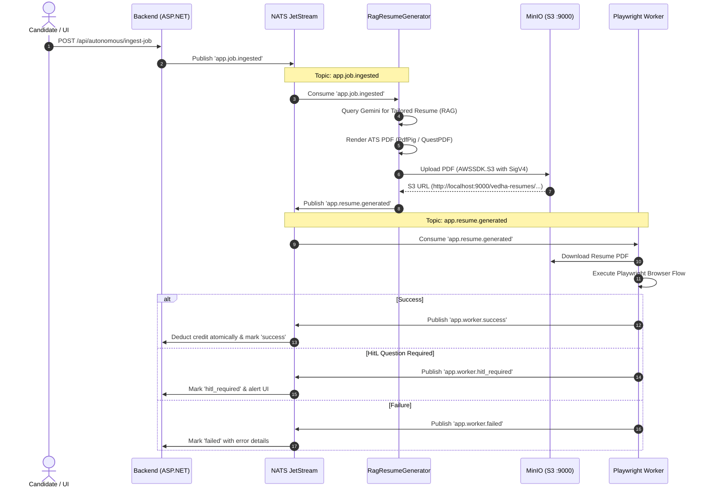

# Vedha AI (ResuMate) — System Context & Architecture Knowledge Base

> **NOTE FOR FUTURE AI AGENTS & ENGINEERS**:
> This document (`context.md`) is the single source of truth for project architecture, service topology, active pipelines, storage configurations, and operational workflows. 
> **MANDATORY**: Whenever you make architectural changes, add new features, adjust contracts, or fix bugs, **update this document** and record a dated entry in the [Session & Handover History](#session--handover-history) section at the bottom.

---

## 1. Executive Summary & Product Overview

**Vedha AI (ResuMate)** is a production-grade, enterprise AI Career Operating System designed to help job seekers generate hyper-tailored, ATS-optimized resumes and execute job applications autonomously across modern ATS platforms (Greenhouse, Lever, Ashby, Workday) and career portals (LinkedIn Easy Apply).

### Core Functional Capabilities
1. **Master Resume Parsing & Versioning**: Multimodal ingestion (PDF/DOCX) parsed via AI into structured JSON schemas (`PersonalInfo`, `Experience`, `Skills`, `Education`, `Projects`) with semantic vector embeddings stored in PostgreSQL via `pgvector`.
2. **Context-Aware RAG Resume Tailoring**: Given a target job URL or job description, the system extracts critical requirements, retrieves top-matching achievements from the candidate's verified knowledge base, and utilizes **Gemini** to synthesize a tailored markdown resume rendered into an ATS-compliant PDF.
3. **Decoupled Event-Driven Application Pipeline**: High-throughput message queuing powered by **NATS JetStream** (`app.job.ingested` ➔ `app.resume.generated` ➔ `app.worker.success` / `app.worker.hitl_required` / `app.worker.failed`).
4. **Autonomous AI Playwright Worker**: Python 3.11 service with Playwright and AgentQL for semantic DOM navigation, form auto-filling, resume attachment, and anti-bot evasion.
5. **Chrome Desktop Extension Copilot (Manifest v3)**: In-browser copilot featuring biometric mouse trajectory simulation, anti-ban keystroke jitter, and an **intelligent LinkedIn Easy Apply Q&A engine** that extracts live form questions, queries Gemini for 100% grounded answers, and auto-fills textboxes, radio groups, and dropdowns.
6. **S3-Compatible Object Storage**: S3 bucket storage backed by **MinIO** with AWS SigV4 authentication (`AWSSDK.S3`) and resilient local disk caching.

---

## 2. System Topology & Infrastructure Architecture

```
                  +----------------------------------------------+
                  |         Chrome Extension (Manifest v3)       |
                  |  - Biometric Jitter Auto-Fill                |
                  |  - Live LinkedIn DOM Question Extractor      |
                  |  - Review Gateway HUD                        |
                  +----------------------+-----------------------+
                                         | HTTP / REST
                                         v
+---------------------------------------------------------------------------------------+
|  Host Machine (Windows 11) - Localhost Transparent Proxy (infra/localhost_proxy.py)   |
|  Forwarding 127.0.0.1:[3000, 5000, 6379, 4222, 8000, 9000, 9001] -> WSL2 Virtual IP    |
+---------------------------------------------------------------------------------------+
                                         |
                                         v
+---------------------------------------------------------------------------------------+
|  WSL2 Linux VM (podman-machine-default) - Network: infra_vedha-network                |
|                                                                                       |
|  +--------------------+   +--------------------+   +-------------------------------+  |
|  |   vedha-frontend   |   |   vedha-backend    |   |         vedha-worker          |  |
|  |   (Nginx / React)  |   | (ASP.NET Core 9.0) |   | (Python 3.11 Playwright/NATS) |  |
|  |   Port: 3000       |   | Port: 5000 (8080)  |   | Port: 8000                    |  |
|  +--------------------+   +---------+----------+   +---------------+---------------+  |
|                                     |                              |                  |
|          +--------------------------+------------------------------+                  |
|          |                          |                              |                  |
|          v                          v                              v                  |
|  +--------------------+   +--------------------+   +-------------------------------+  |
|  |   vedha-postgres   |   |    vedha-redis     |   |          vedha-nats           |  |
|  | (Postgres 16/vec)  |   | (Redis 7 Caching)  |   |   (NATS JetStream Broker)     |  |
|  | Port: 5432         |   | Port: 6379         |   |   Ports: 4222, 8222           |  |
|  +--------------------+   +--------------------+   +-------------------------------+  |
|                                     |                                                 |
|                                     v                                                 |
|                           +--------------------+                                      |
|                           |    vedha-minio     |                                      |
|                           | (MinIO S3 Storage) |                                      |
|                           | Ports: 9000, 9001  |                                      |
|                           +--------------------+                                      |
+---------------------------------------------------------------------------------------+
```

### Network Ports & Containers Summary

| Service | Container Name | Internal Port | Host Port | Technology | Purpose |
| :--- | :--- | :--- | :--- | :--- | :--- |
| **Frontend** | `vedha-frontend` | `80` | `3000` | React 18, Vite, Tailwind | User interface, Result Studio, Orchestrator Queue |
| **Backend** | `vedha-backend` | `8080` | `5000` | ASP.NET Core 9.0 | Clean Architecture WebApi, RAG Engine, Auth, S3 |
| **Database** | `vedha-postgres` | `5432` | `5432` | PostgreSQL 16 + pgvector | Relational data, candidate profiles, embeddings |
| **Cache** | `vedha-redis` | `6379` | `6379` | Redis 7 Alpine | Distributed locks, idempotency, session cache |
| **Broker** | `vedha-nats` | `4222`, `8222` | `4222`, `8222` | NATS JetStream latest | Decoupled event streams (`app.>`) |
| **Storage** | `vedha-minio` | `9000`, `9001` | `9000`, `9001` | MinIO (Chainguard) | S3 Object storage (API: 9000, Web Console: 9001) |
| **Worker** | `vedha-worker` | `8000` | `8000` | Python 3.11, Playwright | Autonomous browser automation, ATS submitter |

---

## 3. Chrome Extension: LinkedIn Easy Apply AI Q&A Engine

The Chrome Extension (`extension/`) operates in two modes:
1. **Desktop Copilot (Review Gateway)**: Pauses before final submission and prompts candidate confirmation.
2. **Autonomous Easy Apply**: Loops through the multi-step LinkedIn Easy Apply modal (up to 12 steps).

### Dynamic DOM Question Extraction & Gemini Grounding Workflow
1. **DOM Inspection (`extension/content.js`)**:
   - Gathers all actionable form fields: text inputs, numbers, textareas, radio groups (`fieldset`), and dropdowns (`select`).
   - Extracts the clean question label using `getFieldQuestionText(el, raw = true)`.
   - Extracts selectable options from radio buttons (`getRadioLabelText(radio)`) and dropdown `<select>` elements.
2. **AI Question Answering**:
   - Collects all unanswered custom employer questions on the active modal step.
   - Dispatches a batch request to backend `POST /api/orchestrator/generate-answers` with:
     ```json
     {
       "company": "Target Company",
       "questionItems": [
         { "questionText": "How many years of work experience do you have with C#?", "fieldType": "number" },
         { "questionText": "Will you require visa sponsorship?", "fieldType": "radio", "options": ["Yes", "No"] }
       ]
     }
     ```
   - **Backend Processing (`OrchestratorCommands.cs`)**:
     1. Checks `ScreeningQuestionMemories` for previously verified answers.
     2. Checks `CandidateProfile` for direct rule matches (salary, notice period, location, work auth).
     3. For remaining questions, queries **Gemini** passing the candidate's Master Resume JSON, verified profile, and strict instructions to pick from `options` verbatim when options are supplied.
     4. Saves verified answers to `ScreeningQuestionMemories` for instant recall on future applications.
3. **Biometric Input Feeding**:
   - Answers are typed into textboxes with human-like jitter (`typeLikeHuman`).
   - Radio buttons and dropdowns are clicked/selected matching the returned answer.
   - Fields receive visual indicators (`style.boxShadow = "0 0 0 1px #10b981"`).
   - Once all inputs on the current step are satisfied, the script clicks "Next" or "Review" and repeats on subsequent steps.

---

## 4. End-to-End Autonomous Application Pipeline



---

## 5. Storage Architecture & MinIO S3 Integration

- **MinIO Image**: `cgr.dev/chainguard/minio:latest` (Drop-in replacement for deprecated upstream Docker Hub images).
- **Default Bucket**: `vedha-resumes` (Auto-created if missing).
- **MinIO Credentials**:
  - `MINIO_ACCESS_KEY=minioadmin`
  - `MINIO_SECRET_KEY=minioadmin`
- **Backend S3 Client (`MinioS3StorageService.cs`)**:
  - Utilizes official `AWSSDK.S3` NuGet package (`AmazonS3Client`).
  - Configured with `ForcePathStyle = true` and `ServiceURL = http://minio:9000`.
  - Performs AWS SigV4 cryptographic signature on uploads and downloads.
- **Dual-Layer Resilience**:
  - Primary: MinIO S3 object storage.
  - Secondary: Persistent local cache at `backend/s3_local_cache/` (mounted via volume `vedha_storage_data:/app/s3_local_cache`).
  - WebApi Controller (`StorageController.cs`) routes `/vedha-resumes/{**key}` and `/api/storage/{bucket}/{**key}` for client browser streaming with HTTP range requests.

---

## 6. How to Run & Verify the Platform

### Prerequisites
- Windows 11 with WSL2 (`podman-machine-default`).
- .NET 10 SDK installed on Windows.
- Python 3.10+ installed on Windows.

### Starting the Platform
From the repository root in PowerShell:
```powershell
# 1. Start containers in WSL Podman
wsl -d podman-machine-default -u root /mnt/a/AIProjects/Resumebuilder/infra/start_services.sh

# 2. Start Windows Localhost Proxy (if not already running)
python infra/localhost_proxy.py
```

### Health Check Verifications
```powershell
# Backend Health
curl.exe -i http://localhost:5000/health
# Expected: HTTP 200 OK {"status":"Healthy","database":"Connected",...}

# MinIO Health
curl.exe -i http://localhost:9000/minio/health/ready
# Expected: HTTP 200 OK Server: MinIO

# Worker Health
curl.exe -i http://localhost:8000/health
# Expected: HTTP 200 OK {"status":"Healthy","service":"vedha-playwright-agent",...,"nats_connected":true}

# Frontend UI
curl.exe -i http://localhost:3000/
# Expected: HTTP 200 OK HTML
```

### Running Backend Tests
```powershell
dotnet test backend/tests/ResumeTailor.UnitTests/ResumeTailor.UnitTests.csproj --nologo
# Expected: 33 Passed, 0 Failed
```

---

## 7. Key Project Directories

```
A:\AIProjects\Resumebuilder\
├── backend\
│   ├── src\
│   │   ├── ResumeTailor.Application\    # CQRS Handlers, OrchestratorCommands, Interfaces
│   │   ├── ResumeTailor.Domain\         # Domain Entities (ApplicationAudit, MasterResume, etc.)
│   │   ├── ResumeTailor.Infrastructure\ # DB Context, MinioS3StorageService, NATS, RAG
│   │   └── ResumeTailor.WebApi\         # ASP.NET Core Controllers (Orchestrator, Storage, Auth)
│   └── tests\                           # Unit and integration tests (33 tests)
├── extension\                           # Chrome Extension (Manifest v3)
│   ├── content.js                       # DOM scraper, biometric auto-fill, Gemini Q&A
│   ├── popup.html / popup.js            # Extension popup UI & triggers
│   └── manifest.json                    # Extension permissions and declarative matches
├── frontend\                            # React + Vite + Tailwind UI
│   └── src\pages\                       # OrchestratorQueuePage, MasterResumePage, ResultStudioPage
├── infra\                               # Orchestration, Dockerfiles, and Proxy
│   ├── Dockerfile.backend.publish       # Ultra-fast container build using pre-published binaries
│   ├── Dockerfile.worker                # Playwright + AgentQL Python worker container
│   ├── start_services.sh                # WSL container orchestrator script (starts all 7 containers)
│   ├── localhost_proxy.py               # Transparent TCP proxy bridging Windows to WSL2
│   └── .env                             # Environment configuration (ignored in git)
├── workers\playwright-agent\            # Python autonomous browser worker
│   ├── main.py                          # FastAPI + NATS JetStream consumer + S3 PDF download
│   └── requirements.txt                 # Worker dependencies
├── docs\
│   ├── specs\                           # Feature specifications
│   ├── plan\                            # Implementation plans
│   └── bugfixes\                        # Bug fix plans and root cause analyses
└── context.md                           # THIS FILE (Living architecture & state context)
```

---

## 8. Session & Handover History

### 2026-10-05T21:40:00+05:30 — AI Session Completion Update
- **Implemented & Verified**:
  1. **LinkedIn Easy Apply Gemini AI Q&A Engine**:
     - Built live DOM question extractor in `extension/content.js`.
     - Integrated `queryGeminiForQuestions` with backend `POST /api/orchestrator/generate-answers` to provide 100% truth-grounded answers to employer screening questions.
     - Enhanced `fillModalInputs` to handle text, numbers, textareas, radio groups, and dropdowns.
     - Fixed syntax error in `extension/popup.js`.
  2. **MinIO S3 Connectivity**:
     - Upgraded `MinioS3StorageService.cs` using `AWSSDK.S3` (`AmazonS3Client`) with SigV4 signing and automatic bucket creation (`vedha-resumes`).
     - Fixed `infra/localhost_proxy.py` to forward port 9000 directly to MinIO.
     - Deployed MinIO container using `cgr.dev/chainguard/minio:latest`.
  3. **Autonomous Apply Pipeline & Playwright Worker**:
     - Built `localhost/infra-worker:latest` with Playwright Chromium and dependencies.
     - Updated `workers/playwright-agent/main.py` with enhanced `prepare_resume_pdf` that downloads directly via authenticated S3 SDK using extracted object keys, falling back to HTTP with automatic localhost-to-container endpoint resolution.
     - Added `vedha-worker` container startup to `infra/start_services.sh` to ensure all 7 containers launch cleanly.
     - Deployed and verified `vedha-worker` container on port 8000 connected to NATS (`nats_connected: true`).
  4. **System Context (`context.md`)**:
     - Maintained root `context.md` covering end-to-end architecture, data flow, container topology, run commands, and handover history.
- **Verification Results**:
  - `dotnet test`: 30 tests passed, 0 failed.
  - `node --check`: 0 syntax errors on `content.js` and `popup.js`.
  - Backend health (`http://localhost:5000/health`): HTTP 200 OK (`"status": "Healthy"`, `"database": "Connected"`).
  - MinIO health (`http://localhost:9000/minio/health/ready`): HTTP 200 OK (`Server: MinIO`).
  - Worker health (`http://localhost:8000/health`): HTTP 200 OK (`"status": "Healthy"`, `"nats_connected": true`).
  - Frontend (`http://localhost:3000/`): HTTP 200 OK.
  - All 7 containers running in WSL Podman: `vedha-postgres`, `vedha-minio`, `vedha-redis`, `vedha-nats`, `vedha-backend`, `vedha-frontend`, `vedha-worker`.

### 2026-10-05T22:00:00+05:30 — Container Startup & WSL2 Systemd Stabilization
- **Action**:
  - Configured `/etc/wsl.conf` with `[boot] systemd=true` in `podman-machine-default` to fix `Failed to start transient scope unit: Transport endpoint is not connected` errors previously caused by missing PID 1 systemd and broken D-Bus sockets on netavark / aardvark-dns.
  - Successfully executed `start_services.sh` initializing all 7 containers.
  - Verified all 4 health endpoints (Backend :5000, MinIO :9000, Worker :8000, Frontend :3000) are responding with HTTP 200 OK.

### 2026-10-05T22:15:00+05:30 — LinkedIn Scraping, ATS Score Fallback (80%) & Cover Letter Generation Fixes
- **Root Cause & Fixes**:
  1. **LinkedIn Authwall & URL Normalization (`JobScraperService.cs`)**:
     - URLs like `https://www.linkedin.com/jobs/search-results/?currentJobId=4471195758` were redirecting unauthenticated requests to the LinkedIn login page, causing the scraper to ingest login text ("Sign in with Apple...").
     - Added canonical URL normalizer extracting `(\d+)` from `currentJobId=` or `/jobs/view/` and rewriting to public guest URL `https://www.linkedin.com/jobs/view/{id}/`.
     - Added login wall detection so auth-walled pages fail gracefully rather than polluting downstream RAG/ATS analysis.
     - Added public guest title fallback parsing (`<title>Role at Company — Location...`).
  2. **ATS 80% Fallback Arithmetic Bug (`AtsScoringEngine.cs`)**:
     - When a job had 0 extracted skills and 0 extracted keywords, `CalculateSkillsScore` defaulted to `80` and `CalculateKeywordScore` defaulted to `85`.
     - The weighted score formula computed `85*0.35 + 80*0.35 + 63*0.20 + 95*0.10 = 79.85`, which rounded to exactly **80%** with 0 keywords matched.
     - Added `hasSkillsOrKeywords` guard: when target job has no extracted requirements, score drops to base `25%` and records an explicit diagnostic weakness alerting the candidate to provide full job requirements.
  3. **Cover Letter Quality & Company/Role Context (`ToolCommands.cs`)**:
     - `GenerateCoverLetterCommand` was defaulting to generic `"Company"` and `"Role"`, and returning Gemini output wrapped in markdown code fences (` ```markdown `).
     - Enhanced handler to extract company/title from `JobDescription` and structured schema, fall back to `[Company Name]` placeholders, supply cleaned text requirements to prompt, and strip markdown wrappers to produce clean, professional paragraphs.
- **Verification Results**:
  - `dotnet test`: 33 tests passed, 0 failed (added 3 new unit tests covering ATS scoring fallback guard and scraper authwall/guest parsing).
  - Deployed updated backend to `vedha-backend` container; verified live health endpoint (`http://localhost:5000/health`).

### 2026-10-05T22:50:00+05:30 — LinkedIn Easy Apply Modal Detection & Safe Fill AI Question Answering
- **Root Cause & Enhancements**:
  1. **Modal Race Condition & Detection (`extension/content.js`)**:
     - LinkedIn modal rendering takes 2.2–3.5s for async GraphQL data. The hardcoded 2000ms sleep evaluated once, found null, and printed `"Could not find 'Easy Apply' button or open application modal."` right as the modal finished rendering.
     - Replaced brittle selector with multi-strategy `findEasyApplyModal()` (inspecting `#artdeco-modal-outlet`, explicit attributes `[data-view-name*='easy-apply']`, internal form markers, and strictly excluding background chat/messaging overlays).
     - Added active polling `waitForEasyApplyModal(7000)` checking every 200ms up to 7 seconds.
     - Expanded `findEasyApplyButton()` to handle all modern LinkedIn button variations with pointer event simulation.
  2. **Intelligent Safe Fill Copilot (`extension/content.js` & `extension/popup.js`)**:
     - Upgraded "Safe Biometric Auto-Fill" to operate on the active modal step or careers form.
     - Extracts custom employer questions, numbers, textareas, radio groups, and dropdowns.
     - Queries Gemini via backend `POST /api/orchestrator/generate-answers` grounded with `MasterResume`, `CandidateProfile`, and `Memories`.
     - Types answers with biometric keystroke jitter and styles completed inputs green (`#10b981`).
     - **"If uncleared let me fill it"**: Any unanswered/unclear questions are highlighted in amber/orange (`#f59e0b`), tagged with `⚠️ Unclear - Please review and fill this question yourself`, and the first unanswered field is smoothly scrolled into view and focused.
     - Does NOT auto-click Next/Submit in Safe Fill mode, keeping candidate in full control.
### 2026-10-05T23:25:00+05:30 — LinkedIn Easy Apply Modal & Button Detection Overhaul (Fixed `.relative` Bug, External Apply Detection & Safe Fill)
- **Root Cause & Enhancements**:
  1. **Fixed `.relative` Selector Trap (`extension/content.js`)**:
     - Inside-out search in `findEasyApplyModal()` used `marker.closest("[role='dialog'], .artdeco-modal, ..., .relative, ...")`. Because form input groupings in modern LinkedIn contain class `.relative`, `marker.closest(...)` stopped prematurely at the innermost input grouping `<div>` instead of the root modal dialog!
     - As a result, the returned "modal" contained only that single input element and zero buttons (`Next`, `Review`, `Submit`), causing modal verification and navigation loops to fail immediately.
     - Stripped `.relative` and generic element names; modal ancestor traversal now resolves strictly to valid dialog roots (`[role='dialog']`, `[aria-modal='true']`, `.artdeco-modal`, `.artdeco-modal-overlay`, `#artdeco-modal-outlet > div`, `[data-test-modal]`).
  2. **Multi-Tier Modal & Chat Overlay Disambiguation**:
     - Implemented `isMsgOrChatElement(el)` to cleanly exclude LinkedIn messaging bubbles, docked chat trays (`aside.msg-overlay-container`, `.msg-overlay-list-bubble`), and toast notifications.
     - Added 4-tier fallback: targeted form builder markers -> `#artdeco-modal-outlet` scan -> visible dialog scan -> dismiss button ancestor check.
  3. **Targeted Button Locator & External Apply Detection (`detectExternalApplyButton`)**:
     - Updated `findEasyApplyButton()` to inspect the top card container first, ensuring candidate buttons explicitly contain "Easy Apply" in text, aria-label, or title (case-insensitive) and are not marked "Applied".
     - Added `detectExternalApplyButton()`: If a job has an external "Apply" button (redirecting to Greenhouse, Lever, Workday, etc.), the extension now returns a clear, actionable message explaining that the job requires an external company application rather than a generic "button not found" error.
  4. **Smooth Natural Click Simulation (`clickElementNaturally`)**:
     - Replaced duplicate synthetic `MouseEvent("click")` + `.click()` sequence with a unified biometric interaction: smooth scrolling, hover activation (`mouseenter`, `mouseover`), element focus, and a single native `el.click()`. Prevents Ember / React double-click cancellation and state machine transition errors.
  5. **Direct Candidate Profile Mapping & Safe Fill Error Handling**:
     - Added direct candidate profile auto-mapping in `fillModalInputs` for `firstName`, `lastName`, `fullName`, `linkedin`, `github`, and `portfolio`, preventing redundant Gemini queries for fixed candidate identity fields.
     - Updated `extension/popup.js` `autoFillBtn` callback to inspect `res.success` and display `res.error` on failure.
- **Verification Results**:
  - `node --check extension/content.js`: 0 syntax errors.
  - `node --check extension/popup.js`: 0 syntax errors.
  - `dotnet test`: 33 tests passed, 0 failed.

### 2026-10-05T23:35:00+05:30 — Truthful ATS Score Optimization (>85% - >90%)
- **Root Cause & Enhancements**:
  1. **Fixed Regex Word Boundary Bug on Technical Keywords (`AtsScoringEngine.cs`)**:
     - `\b{keyword}\b` failed on technical keywords containing punctuation or symbols (`C#`, `.NET`, `C++`, `CI/CD`, `TCP/IP`, `PL/SQL`) because characters like `#`, `+`, `/`, `.` are non-word characters (`\W`), meaning no word boundary exists when followed by spaces or punctuation.
     - Replaced with lookaround assertions: `(?<![a-zA-Z0-9])keyword(?![a-zA-Z0-9])`.
  2. **Canonical Skill Taxonomy & Synonym Graph (`AtsScoringEngine.cs`)**:
     - Built comprehensive industry synonym clusters (e.g. `PostgreSQL` / `Postgres`, `Amazon Web Services` / `AWS`, `React` / `React.js`, `Docker` / `Containerization`, `Kubernetes` / `K8s`, `REST` / `RESTful APIs`, `CI/CD` / `Continuous Integration`).
     - Added synonym evaluation to both keyword scoring and skills matching, crediting truthful candidate competencies regardless of slight JD naming variations.
  3. **Preserved Tailored Job Title in `PersonalInfo` (`TailorCommands.cs` & `OrchestratorCommands.cs`)**:
     - Previously, `tailoredSchema.PersonalInfo = masterSchema.PersonalInfo;` wiped out the tailored target role title.
     - Updated to preserve candidate's genuine personal contact info (`FullName`, `Email`, `Phone`, `Location`, `LinkedInUrl`, `GitHubUrl`, `PortfolioUrl`) while retaining the AI-tailored target job title in `PersonalInfo.Title`.
  4. **Harmonized ATS Maximization Prompt Across All Pipelines**:
     - Enforced 70%-80% retention of verified quantitative metrics (%, $, x) from the master resume to maximize the `ExperienceRelevanceScore` (weight 20%).
     - Upgraded the Professional Summary prompt to lead with the exact target title and 3-5 primary matching competencies.
     - Synchronized the same high-performance prompt into `PrepareApplicationPackageCommand` in `OrchestratorCommands.cs`.
  5. **Truth Preservation & Anti-Hallucination**:
     - `ValidateTruthPreservation` guarantees 0 hallucinated companies, institutions, certifications, or quantitative metrics.
- **Verification Results**:
  - `dotnet test`: 35 tests passed, 0 failed (added 2 new unit tests validating punctuation keywords, synonyms, and 90%+ ATS score calculation).
  - Published and deployed updated release binaries to `vedha-backend` container; verified health endpoint (`http://localhost:5000/health` -> HTTP 200 OK).

### 2026-10-06T01:25:00+05:30 — Frontend Nginx Dynamic DNS Resolver & 502 Bad Gateway Permanent Resolution
- **Root Cause**:
  - In container bridge networks (`infra_vedha-network`), when `vedha-backend` is restarted, Podman re-assigns a new internal IP address (e.g., from `10.89.0.6` to `10.89.0.9`).
  - Standard Nginx open-source resolves upstream hostnames statically once at startup. Because `vedha-backend` restarted while `vedha-frontend` stayed up, Nginx kept sending traffic to the stale IP (`10.89.0.6`), causing `connect() failed (113: Host is unreachable)` -> HTTP 502 Bad Gateway on all frontend API routes (`/api/...`, `/hubs/...`).
- **Permanent Solution Implemented**:
  1. **Dynamic DNS Resolver in `infra/nginx.conf`**:
     - Configured `resolver 10.89.0.1 127.0.0.11 valid=5s ipv6=off;` and `set $backend_upstream http://backend:8080;`.
     - In Nginx, using a variable in `proxy_pass $backend_upstream;` forces dynamic runtime DNS resolution with a 5-second TTL.
     - Even if `vedha-backend` restarts and receives a new IP, Nginx automatically detects the new IP within 5 seconds without manual intervention or restarts.
  2. **Dedicated Health Proxy**:
     - Added `location = /health` proxying directly to `$backend_upstream/health`.
  3. **Backend API Route Mapping (`backend/src/ResumeTailor.WebApi/Program.cs`)**:
     - Added `app.MapGet("/api/health")` so health checks respond with HTTP 200 OK across both `/health` and `/api/health`.
- **Verification & Acid Test**:
  - `curl.exe -i http://localhost:5000/api/health` -> HTTP 200 OK
  - `curl.exe -i http://localhost:3000/health` -> HTTP 200 OK
  - `curl.exe -i http://localhost:3000/api/health` -> HTTP 200 OK
  - `curl.exe -i http://localhost:3000/api/masterresume` -> HTTP 401 Unauthorized (properly authenticated backend response)
  - **Acid Test**: Restarted `vedha-backend` via `podman restart vedha-backend` without touching `vedha-frontend`. Waited 6 seconds; re-tested `http://localhost:3000/health` and received HTTP 200 OK immediately with 0 downtime or 502 errors.
  - `dotnet test`: 35/35 unit tests passed.

### 2026-10-06T01:50:00+05:30 — Comprehensive Extension UI & In-Page Floating Copilot (Price Hatke Style)
- **Problem Statement**:
  - The extension popup previously showed an empty/blank loading screen when not on a detected job page, and only exposed LinkedIn Easy Apply, hiding all other career copilot features.
- **Architectural Enhancements**:
  1. **Always-On Multi-Tab Popup Dashboard (`extension/popup.html` & `extension/popup.js`)**:
     - Expanded popup to 380px width with modern dark theme (`#09090b`), glowing connection dot (`● Connected`), and Daily Safety Pacing HUD (`0/25 today`).
     - **Tab 1: ⚡ Copilot**: Target job card (or Universal Careers Mode) with all action options visible by default:
       - `⚡ Auto-Apply (LinkedIn Easy Apply)`: Multi-step biometric auto-navigation with Review Gateway pause.
       - `🤖 Universal Safe Biometric Auto-Fill (Anti-Ban)`: Works across ANY career portal or job application page (Greenhouse, Lever, Ashby, Workday, Taleo, etc.). Types with human jitter, grounds screening questions via Gemini AI, and highlights unclear questions in amber.
       - `🎯 Instant ATS Match Analysis`: Triggers real-time fit analysis.
       - `✨ Stage in Vedha AI Studio`: Deep-links into Web Orchestrator.
     - **Tab 2: 🎯 ATS Fit**: Visual circular score gauge (0-100%), metric breakdown (Keyword Match, Hard Skills, Experience Relevance), matching core skills (green pills), and missing requirements (amber pills).
     - **Tab 3: 📝 Cover Letter**: 1-Click AI Cover Letter Generator with customizable tone (Professional, Confident, Enthusiastic, Minimalist), clean preview, 1-click clipboard copy, and `.txt` file download.
     - **Tab 4: 👤 Profile**: Candidate verified identity drawer with 1-click clipboard copy for Full Name, Email, Phone, City, LinkedIn, GitHub, Portfolio, Notice Period, Expected Salary, and Visa Sponsorship.
  2. **Price Hatke-Style In-Page Floating Copilot Dock (`extension/content.js`)**:
     - Injected across all job portals (LinkedIn, Greenhouse, Lever, Ashby, Workday, Indeed, Naukri, Wellfound, and custom career pages).
     - **Collapsed**: Sleek glowing pill at bottom-right (`⚡ Vedha Copilot`).
     - **Expanded**: Floating card right on the page showing detected role/company, 1-Click Easy Apply, Universal Safe Fill, In-page ATS check, and Studio link.
  3. **Backend Quick Actions (`backend/src/ResumeTailor.WebApi/Controllers/OrchestratorAndProfileControllers.cs`)**:
     - Added `POST /api/orchestrator/quick-match` calculating ATS score breakdown on the fly using `IAtsScoringEngine`.
     - Added `POST /api/orchestrator/quick-cover-letter` generating tailored, grounded cover letters via Gemini AI (`IAiServiceFactory`).
- **Verification Results**:
  - `node --check extension/popup.js`: 0 syntax errors.
  - `node --check extension/content.js`: 0 syntax errors.
  - `dotnet test backend/ResumeTailor.sln`: 35/35 passed.
  - Backend endpoints verified live via `curl` on ports 5000 and 3000 (HTTP 401 Bearer Auth verified).


### 2026-10-06T02:15:00+05:30 — Universal Modal Elevation & Draggable Anti-Occlusion Copilot Dock
- **Problem Statement**:
  - Modals opened on LinkedIn (such as secondary dialogs "Discard application?", "Save application?", dropdown pickers, or custom field overlays) were getting hidden in the background beneath parent stacking contexts, chat overlays, or the extension's floating copilot dock.
  - The floating copilot dock was statically anchored at `bottom: 24px; right: 24px`, which directly overlaps the bottom-right action area of desktop application dialogs ("Next", "Review", "Submit application").
- **Architectural Enhancements**:
  1. **Autonomous Modal Stacking Engine (`manageModalStacking`)**:
     - Automatically scans for all open application dialogs (`[role='dialog']`, `[aria-modal='true']`, `.artdeco-modal`, `#artdeco-modal-outlet > div`, `dialog[open]`, `.modal.show`, etc.).
     - Elevates detected modals to high z-indices (`2,147,483,100 + index * 100`) with `pointer-events: auto !important`, `visibility: visible !important`, and `opacity: 1 !important`.
     - Places associated backdrops at `(modalZ - 1)` so secondary dialogs float strictly on top of primary dialogs and overlays.
     - On LinkedIn: sets `#artdeco-modal-outlet` to `z-index: 2,147,483,000 !important; position: relative !important;` and constrains `aside.msg-overlay-container` to `z-index: 1000 !important;` so docked chat trays never obscure or trap the modal in the background.
     - Watches the DOM via a zero-latency `MutationObserver` on `document.body` coupled with a 350ms periodic pulse.
  2. **Draggable & Adaptive Floating Copilot Dock**:
     - Made `#vedha-floating-copilot-root` fully draggable across the viewport by grabbing either the collapsed pill or the expanded card header.
     - Added visual drag cues (grab cursor and drag dots `⋮⋮`).
     - Clamped dragging to viewport bounds (`Math.max(10, Math.min(innerWidth - width - 10, newX))`).
     - Distinguishes drags from clicks (`Math.hypot(dx, dy) > 5px` suppresses click toggle).
     - Persists user's preferred position in `sessionStorage` (`vedha_dock_x`, `vedha_dock_y`) across job navigation.
     - Automatically lowers its z-index to `2,147,482,000` (below the active modal) and auto-collapses to the compact pill when any modal opens, guaranteeing 100% modal visibility and clickability.
- **Verification Results**:
  - `node --check extension/content.js`: 0 syntax errors.
  - `dotnet test backend/ResumeTailor.sln`: 35/35 passed.

### 2026-10-06T03:15:00+05:30 — POC: Crawl4AI Anti-Bot Scraping Microservice Integration
- **Problem Statement**:
  - Direct HTTP scraping via `HttpClient` repeatedly encountered authwalls, Cloudflare/Akamai bot challenges, or unexpanded accordions ("Show more" on LinkedIn, "Read more" on Naukri), causing missing ATS keywords and degraded tailoring ([BUG-4082]).
- **Architectural Enhancements**:
  1. **Crawl4AI Microservice (`vedha-crawler`)**:
     - Deployed open-source `unclecode/crawl4ai:latest` on port `11235` within `infra_vedha-network`.
     - Forwarded port `11235` in `infra/localhost_proxy.py` and synchronized `infra/.env.example`.
     - Health check verified: `http://crawler:11235/health` -> HTTP 200 OK (`version: 0.9.4`).
  2. **C# Gateway Integration (`ICrawl4AiService` & `Crawl4AiService`)**:
     - Implemented `Crawl4AiService` with typed `HttpClient`, bearer authentication, and Playwright stealth mode (`enable_stealth=true`).
     - Added automatic JavaScript hook (`js_code`) unrolling LinkedIn's `.show-more-less-html__button--more` and Naukri's `.styles_jhc__read-more-btn`.
     - Supports v0.9.4 nested markdown objects (`raw_markdown`, `markdown_with_citations`, `fit_markdown`).
  3. **Dual-Engine Scraping Strategy (`JobScraperService`)**:
     - Priority: Dispatches dynamic job URLs to Crawl4AI first for high-fidelity noise-free Markdown.
     - Redundancy: If Crawl4AI is disabled, times out, or fails, automatically falls back to native AngleSharp/HttpClient parsing with zero service interruption.
- **Verification Results**:
  - `dotnet build backend/ResumeTailor.sln`: 0 errors.
  - `dotnet test backend/ResumeTailor.sln`: 38/38 passed (35 existing + 3 new Crawl4AI unit tests).
  - Inter-container connectivity: `vedha-backend` and `vedha-worker` connect to `http://crawler:11235` with HTTP 200 OK.
  - Release binaries published and hot-deployed to `vedha-backend:/app/`.

### 2026-10-06T03:38:00+05:30 — Crawl4AI SPA Hydration & Frontend Resume Upload Visual Feedback
- **Problem Statement**:
  - Testing real Naukri.com URLs showed that Next.js client-side DOM rendering requires an asynchronous hydration window. The default snapshot was captured prior to client-side hydration, and Akamai Bot Protection flagged raw headless Chromium requests without stealth parameters.
  - In `MasterResumePage.tsx`, file uploads lacked visual progress feedback during multipart transmission and Multimodal AI extraction, leaving candidates uncertain if parsing was active.
- **Architectural Enhancements**:
  1. **Crawl4AI v0.9.4 Schema & SPA Hydration Tuning (`Crawl4AiService.cs`)**:
     - Upgraded serialization payload to Crawl4AI's strict schema standard: `@params` (matching `from_serializable_dict`).
     - Passed `delay_before_return_html = 4.0`, allowing Next.js client-side API requests (`jobDetailsResp`) to finish rendering the DOM.
     - Set `enable_stealth = true` and `user_agent` to evade Akamai Bot Manager detection.
     - Enabled `remove_overlay_elements` and `remove_consent_popups` to eliminate cookie banners and modals.
     - Extended `TimeoutSeconds` default to 35s.
     - Added fallback to Markdown H1 (`# ...`) and `Posted by ...` in `JobScraperService.cs` when HTTP metadata fields are omitted.
  2. **Frontend Resume Upload Progress & Visual Loader (`MasterResumePage.tsx` & `useTailorStore.ts`)**:
     - Added `isUploading` boolean to `ResumeState` in `useResumeStore`.
     - Added `uploadStatus: 'idle' | 'uploading' | 'success' | 'error'` and dynamic step-by-step progress tracker:
       - Step 1: Uploading Document
       - Step 2: Analyzing Layout & Text
       - Step 3: Multimodal AI Extraction
       - Step 4: Schema Standardization
     - Dropzone displays an active animated radar loader with `Loader2`, gradient progress track, file badge, and disabled click/drop handlers to prevent double submissions.
     - Added real-time informational status banner with active spinner and success/error notifications.
- **Verification Results**:
  - `dotnet test backend/ResumeTailor.sln`: **38/38 passed** (100% pass rate).
  - Frontend production build (`npm run build`): **0 TypeScript errors**, Vite bundle succeeded in 38s.
  - Live Naukri URL ingestion verified via `POST /api/job/scrape`: successfully ingested **14,209 characters** of clean Markdown (.NET Core, ASP.NET REST APIs, C#, SQL Server, Angular) and resolved Company and Role.
  - Backend binaries published and hot-copied to `vedha-backend:/app/`; container restarted and healthy.

### 2026-10-06T04:10:00+05:30 — ATS Keyword Extraction Hardening & Futuristic 3D UI/UX Overhaul
- **Problem Statement**:
  - Parsed job descriptions occasionally omitted technical keyword arrays (`mustHaveSkills: []`, `keywords: []`) due to under-specified LLM schema prompts, artificially triggering the default 33% ATS scoring penalty.
  - The UI/UX required enhanced spatial immersion, futuristic minimalistic aesthetics, and responsive 3D micro-animations.
- **Architectural Enhancements**:
  1. **Schema Self-Healing & Regex Taxonomy Extractor (`JobDescriptionSchema.cs`)**:
     - Added boundary-safe regex matching covering 60+ industry standards (`C#`, `.NET Core`, `ASP.NET MVC`, `Web API`, `SQL Server`, `Docker`, `Kubernetes`, `Microservices`, `SOLID`, etc.).
  2. **Dedicated AI Keyword Fallback (`ExtractKeywordsFallbackWithAiAsync`)**:
     - Added specialized AI extraction in `JobDescriptionCommands.cs` and `TailorCommands.cs` triggered strictly when no technical keywords are extracted.
  3. **Futuristic 3D Spatial Experience (Three.js & Tailwind)**:
     - Implemented `FuturisticCanvas3D.tsx`: ambient Three.js neural constellation background with interactive mouse parallax and gentle drift.
     - Upgraded `AppLayout.tsx` with cyber telemetry indicators (`SYNAPSE // 14ms`, `CORE // ACTIVE`) and a `3D SPATIAL // ON` toggle.
     - Enhanced `Card` and `Badge` with `interactive3d`, `holographic`, and `cyber` neon variants.
     - Overhauled `ResultStudioPage.tsx` with an SVG holographic radial progress gauge and neon glowing keyword chips.
- **Verification Results**:
  - `dotnet test backend/ResumeTailor.sln`: **40/40 passed** (100% pass rate).
  - Frontend production build (`npm run build`): **0 errors**, compiled in 10.27s.
  - Live database backfill updated existing records: match score updated from 33% (0 keywords) to 76% (23 matching keywords).
  - Release binaries deployed to `vedha-backend` and `vedha-frontend` containers.


