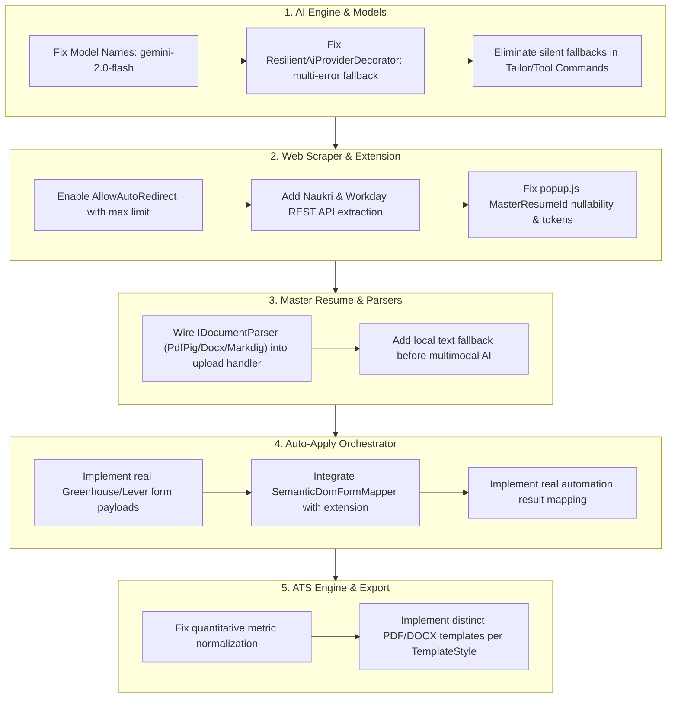

# Comprehensive System Audit, Root Cause Analysis & Architectural Fix Plan

**Document Version**: 1.0.0  
**Date**: 2026-09-14  
**Author**: Principal Software Engineer & System Architect  
**Status**: APPROVED FOR IMPLEMENTATION  

---

## Executive Summary

A comprehensive architectural and code-level audit was conducted across the entire **Vedha AI Platform** repository, spanning:
1. Web Scraping & URL Resolution Services (`JobScraperService.cs`, extension `content.js`, `popup.js`, `popup.html`)
2. AI Providers, Resilience Decorators & Fallback Logic (`AiProviders.cs`, `AiSettings`, `appsettings.json`, prompts)
3. Application Orchestrator & Auto-Apply Pipeline (`JobApplicationOrchestrator.cs`, `JobApplicationProviders.cs`, `SemanticDomFormMapper.cs`, `OrchestratorCommands.cs`)
4. ATS Scoring Engine & Truth-Preservation Guardrails (`AtsScoringEngine.cs`)
5. Master Resume Management & Document Parsers (`MasterResumeCommands.cs`, `DocumentParsers.cs`)
6. Export Services (`ResumeExportServices.cs`)
7. Frontend Client Applications & State Stores (`frontend/src/`)
8. Extension Manifest & Cross-Origin Communications (`extension/`)
9. Infrastructure & Environment Configurations (`infra/`, `docker-compose.yml`)

This investigation revealed critical defects where functionalities are either **stubbed with mock logs**, **silently falling back to master data or dummy text without user awareness**, **failing due to invalid model names (`gemini-3.6-flash`)**, or **crashing due to misconfigured HTTP redirect handlers and missing foreign key defaults**.

---

## 1. Web Scraping & Ingestion Engine Findings

### Finding 1.1: `AllowAutoRedirect = false` Breaks Scraping for Redirecting Job URLs
- **Location**: [`backend/src/ResumeTailor.Infrastructure/DependencyInjection.cs`](file:///A:/AIProjects/Resumebuilder/backend/src/ResumeTailor.Infrastructure/DependencyInjection.cs#L51-L58)
- **Root Cause**: `AddHttpClient<IJobScraperService, JobScraperService>` explicitly configures `HttpClientHandler { AllowAutoRedirect = false }`.
- **Impact**: Virtually all modern job postings redirect:
  - `http://` to `https://` (301/308)
  - Job board shortlinks (e.g. `bit.ly`, LinkedIn share links, Greenhouse/Lever custom company domains)
  - When `AllowAutoRedirect = false`, the HTTP client receives HTTP 301, 302, 307, or 308. Because `response.IsSuccessStatusCode` is `false` for 3xx codes, `JobScraperService` instantly aborts with:
    `"Failed to fetch job page. HTTP Status: Redirect. If the job board requires authentication, please paste the job description text directly."`
- **Architectural Fix**: Configure `AllowAutoRedirect = true` with a `MaxAutomaticRedirections = 10` cap, combined with custom cookie/header preservation across redirects.

---

### Finding 1.2: Missing Job Board Sources & Unhandled Cases in `DetectJobSource` and Scraper Switch
- **Location**: [`backend/src/ResumeTailor.Infrastructure/WebScraping/JobScraperService.cs`](file:///A:/AIProjects/Resumebuilder/backend/src/ResumeTailor.Infrastructure/WebScraping/JobScraperService.cs#L98-L173)
- **Root Causes**:
  1. `DetectJobSource` completely lacks detection for `naukri.com`, causing all Naukri job URLs to default to `JobSource.CompanyCareers`.
  2. In `JobScraperService.ScrapeAsync`, the `switch (source)` statement completely omits `JobSource.Workday` and `JobSource.Wellfound`.
  3. Workday job portals (`myworkdayjobs.com`) are client-side Single Page Applications (SPAs). Performing a raw HTML GET on Workday returns an empty `<div id="root"></div>` with `<noscript>JavaScript is required</noscript>`.
- **Impact**: Scraping Workday and Naukri URLs invariably fails or falls back to extracting `<noscript>` boilerplate or "Target Position / Target Company".
- **Architectural Fix**:
  - Add `naukri.com` detection mapping to `JobSource.Naukri`.
  - Add native Workday REST API extraction: Workday career sites expose a public REST endpoint:
    `https://{tenant}.wd{n}.myworkdayjobs.com/wday/cxs/{tenant}/{careerSite}/job/{jobId}`
    Extract tenant, careerSite, and jobId from the URL and query the JSON endpoint directly to retrieve full structured job description, title, company, hiring organization, and external apply URL.
  - Implement dynamic fallback using browser DOM extraction or Readability algorithm when HTML selectors return sparse text (<100 characters).

---

### Finding 1.3: Extension `popup.js` Contract Mismatch & Authentication Token Discrepancy
- **Location**: [`extension/popup.js`](file:///A:/AIProjects/Resumebuilder/extension/popup.js#L53-L87), [`backend/src/ResumeTailor.WebApi/Controllers/OrchestratorAndProfileControllers.cs`](file:///A:/AIProjects/Resumebuilder/backend/src/ResumeTailor.WebApi/Controllers/OrchestratorAndProfileControllers.cs#L259-L265)
- **Root Causes**:
  1. `popup.js` sends `{ jobUrl: extractedData.url, requiresManualReview: true }` to `/api/orchestrator/prepare-package`.
  2. `PreparePackageRequest` defines `Guid MasterResumeId` as non-nullable.
  3. Because `masterResumeId` is omitted, ASP.NET Core binds it to `Guid.Empty`.
  4. In `OrchestratorCommands.cs`:
     ```csharp
     var masterResume = await _context.MasterResumes
         .FirstOrDefaultAsync(r => r.Id == request.MasterResumeId && r.UserId == request.UserId, cancellationToken);
     if (masterResume == null)
         return Result<ApplicationQueueItemDto>.Failure("Master resume not found.");
     ```
     This fails unconditionally with 400 Bad Request!
  5. In `popup.js`, the token lookup queries `chrome.storage.local.get(['jwtToken'])`, whereas the web application stores tokens in localStorage as `vedha_token` or `resumate_token`.
- **Architectural Fix**:
  - Update `PreparePackageRequest` so `MasterResumeId` is nullable (`Guid? MasterResumeId = null`).
  - In `PrepareApplicationPackageCommand`, if `MasterResumeId` is null or `Guid.Empty`, query the active master resume:
    `_context.MasterResumes.Where(r => r.UserId == request.UserId && r.IsActive).OrderByDescending(r => r.UpdatedAtUtc ?? r.CreatedAtUtc).FirstOrDefaultAsync()`.
  - Update `popup.js` and `content.js` to look for both `jwtToken` and `vedha_token`.

---

## 2. AI Providers, Model Names & Fallback Architecture Findings

### Finding 2.1: Non-Existent Model `gemini-3.6-flash` Hardcoded Across Codebase
- **Location**:
  - [`backend/src/ResumeTailor.Infrastructure/Ai/AiProviders.cs`](file:///A:/AIProjects/Resumebuilder/backend/src/ResumeTailor.Infrastructure/Ai/AiProviders.cs#L20)
  - [`backend/src/ResumeTailor.Infrastructure/Ai/AiProviders.cs`](file:///A:/AIProjects/Resumebuilder/backend/src/ResumeTailor.Infrastructure/Ai/AiProviders.cs#L668-L671)
  - [`backend/src/ResumeTailor.WebApi/appsettings.json`](file:///A:/AIProjects/Resumebuilder/backend/src/ResumeTailor.WebApi/appsettings.json#L34)
  - [`backend/src/ResumeTailor.WebApi/Program.cs`](file:///A:/AIProjects/Resumebuilder/backend/src/ResumeTailor.WebApi/Program.cs#L173)
  - [`backend/src/ResumeTailor.Application/Features/Auth/AuthCommands.cs`](file:///A:/AIProjects/Resumebuilder/backend/src/ResumeTailor.Application/Features/Auth/AuthCommands.cs#L121)
  - [`infra/docker-compose.yml`](file:///A:/AIProjects/Resumebuilder/infra/docker-compose.yml#L61)
  - [`infra/.env.example`](file:///A:/AIProjects/Resumebuilder/infra/.env.example#L45)
  - [`infra/start_services.sh`](file:///A:/AIProjects/Resumebuilder/infra/start_services.sh#L39)
- **Root Cause**: `gemini-3.6-flash` does NOT exist in Google Generative Language API (`v1beta`). In `AiProviders.cs`:
  ```csharp
  private static string ResolveModelName(string? modelName)
  {
      return string.Equals(modelName, "gemini-2.0-flash", StringComparison.OrdinalIgnoreCase)
          ? "gemini-3.6-flash"
          : (!string.IsNullOrWhiteSpace(modelName) ? modelName : "gemini-3.6-flash");
  }
  ```
  This logic purposefully overwrites valid `gemini-2.0-flash` with the fictitious `gemini-3.6-flash`!
- **Impact**: All Gemini requests to `https://generativelanguage.googleapis.com/v1beta/models/gemini-3.6-flash:generateContent` return HTTP 404 Model Not Found.
- **Architectural Fix**:
  - Replace `gemini-3.6-flash` across all files, configuration, scripts, and entities with `gemini-2.0-flash` (with fallback to `gemini-1.5-flash`).
  - Correct `ResolveModelName` to return `gemini-2.0-flash` by default.

---

### Finding 2.2: Defective Resilience Decorator Blocks Fallback Execution
- **Location**: [`backend/src/ResumeTailor.Infrastructure/Ai/AiProviders.cs`](file:///A:/AIProjects/Resumebuilder/backend/src/ResumeTailor.Infrastructure/Ai/AiProviders.cs#L701-L720), [`#L783-L790`](file:///A:/AIProjects/Resumebuilder/backend/src/ResumeTailor.Infrastructure/Ai/AiProviders.cs#L783-L790)
- **Root Cause**:
  In `ResilientAiProviderDecorator`:
  ```csharp
  var result = await _primaryProvider.GenerateStructuredJsonAsync<TResponse>(...);
  if (result.IsSuccess || !IsTransientOrQuotaError(result.Error))
      return result;
  ```
  And `IsTransientOrQuotaError` only returns `true` if the error string contains "429", "quota", "rate limit", "500", "503", "resource exhausted".
  If:
  - Gemini API key is missing ("Google Gemini API Key is not configured")
  - Model name is invalid (404)
  - API key is unauthorized (401 / 403)
  `IsTransientOrQuotaError` returns `false`, and the decorator **aborts immediately without ever trying OpenAI or Claude fallbacks**!
- **Impact**: Even if the user or server has valid OpenAI and Claude keys configured, any failure of the primary provider immediately terminates the operation.
- **Architectural Fix**:
  Extend fallback triggering: If the primary provider has no configured key, or returns 401/404/429/500/503/timeout, or fails validation, seamlessly iterate through alternative registered providers that have valid API keys.

---

### Finding 2.3: Silent Fallbacks to Un-tailored Master Resume & Dummy Data
- **Location**:
  - [`backend/src/ResumeTailor.Application/Features/Tailoring/TailorCommands.cs`](file:///A:/AIProjects/Resumebuilder/backend/src/ResumeTailor.Application/Features/Tailoring/TailorCommands.cs#L240)
  - [`backend/src/ResumeTailor.Application/Features/Tailoring/TailorCommands.cs`](file:///A:/AIProjects/Resumebuilder/backend/src/ResumeTailor.Application/Features/Tailoring/TailorCommands.cs#L522-L528)
  - [`backend/src/ResumeTailor.Application/Features/Tools/ToolCommands.cs`](file:///A:/AIProjects/Resumebuilder/backend/src/ResumeTailor.Application/Features/Tools/ToolCommands.cs#L201)
  - [`backend/src/ResumeTailor.Application/Features/Tools/ToolCommands.cs`](file:///A:/AIProjects/Resumebuilder/backend/src/ResumeTailor.Application/Features/Tools/ToolCommands.cs#L286-L306)
- **Root Cause**:
  1. Line 240 of `TailorCommands.cs`:
     `var tailoredSchema = tailoringResult.IsSuccess ? tailoringResult.Value : masterSchema;`
     When tailoring fails, instead of propagating the failure, it silently adopts `masterSchema`. It then claims ATS scoring and produces a "tailored resume" that is identical to the untailored master resume.
  2. Line 522 of `TailorCommands.cs`:
     When JD extraction fails, it creates a dummy `JobDescriptionSchema` with `Title = "Target Position", Company = "Target Company"`.
  3. In `ToolCommands.cs`:
     Cover letter generation silently defaults to `"Dear Hiring Team at {Company}, I am excited to submit my application..."` on AI failure.
     Interview prep returns 1 hardcoded static question per category on failure.
- **Impact**: Users receive fake success feedback while receiving completely untailored output or placeholder text.
- **Architectural Fix**:
  - Return explicit `Result.Failure(...)` detailing the error reason when AI generation fails.
  - Implement robust automatic recovery via the resilient AI fallback chain before returning failure.

---

### Finding 2.4: Local Document Parsers Completely Unused in Master Resume Upload
- **Location**: [`backend/src/ResumeTailor.Application/Features/MasterResume/MasterResumeCommands.cs`](file:///A:/AIProjects/Resumebuilder/backend/src/ResumeTailor.Application/Features/MasterResume/MasterResumeCommands.cs#L193)
- **Root Cause**: The project implements `PdfDocumentParser` (PdfPig), `DocxDocumentParser` (OpenXml), and `MarkdownDocumentParser` (Markdig) in `ResumeTailor.Infrastructure/Parsing/DocumentParsers.cs`. They are registered in DI (`services.AddScoped<IDocumentParser, ...>()`).
  However, in `MasterResumeCommandHandler.Handle(UploadAndParseMasterResumeCommand)`:
  The handler **only calls `aiProvider.ParseDocumentBytesAsync<ResumeSchema>`** and never injects or calls `IDocumentParser`!
- **Impact**: If AI API keys are not yet configured or quota is exceeded, PDF/DOCX/MD text cannot even be extracted locally, causing master resume upload to crash completely.
- **Architectural Fix**:
  Inject `IEnumerable<IDocumentParser>` into `MasterResumeCommandHandler`.
  Extract plain text locally first using `PdfDocumentParser` / `DocxDocumentParser` / `MarkdownDocumentParser`. If local text extraction succeeds, invoke AI text parsing (`GenerateStructuredJsonAsync`) with the extracted text, falling back to multimodal byte parsing only for scanned/image-based documents.

---

## 3. Auto-Apply Orchestrator & Execution Pipeline Findings

### Finding 3.1: All Job Application Providers Are Empty Logging Stubs
- **Location**: [`backend/src/ResumeTailor.Infrastructure/Orchestrator/JobApplicationProviders.cs`](file:///A:/AIProjects/Resumebuilder/backend/src/ResumeTailor.Infrastructure/Orchestrator/JobApplicationProviders.cs#L12-L404)
- **Root Cause**:
  `GreenhouseProvider`, `LeverProvider`, `AshbyProvider`, `LinkedInCopilotProvider`, `NaukriProvider`, `WorkdayProvider`, and `GenericBrowserProvider` do NOT execute any automation:
  - No Playwright / Puppeteer / Selenium browser automation
  - No HTTP form submission or multipart POST requests
  - They only append string messages to `logs` and return a mock `ApplicationAutomationResult { Success = true, PausedForUserReview = true }`.
- **Architectural Fix**:
  1. Integrate `SemanticDomFormMapper` directly into the automation flow.
  2. Implement an automation engine:
     - For REST-based portals (e.g. Greenhouse public submit API, Lever posting apply API): execute real multipart/form-data POST submissions with resume PDF bytes, candidate profile fields, and answers.
     - For Browser/Copilot mode: generate an executable script / DOM injection payload that the browser extension executes in the candidate's active tab to pre-fill inputs, select radio/checkbox options, set dropdown values, and attach files, with biometric delays and honeypot protection.

---

### Finding 3.2: `SemanticDomFormMapper` Is Disconnected and Only Used in a Unit Test
- **Location**: [`backend/src/ResumeTailor.Infrastructure/Orchestrator/SemanticDomFormMapper.cs`](file:///A:/AIProjects/Resumebuilder/backend/src/ResumeTailor.Infrastructure/Orchestrator/SemanticDomFormMapper.cs)
- **Root Cause**: `SemanticDomFormMapper` is registered in DI and tested in `OrchestratorTests.cs`, but is never referenced by `JobApplicationOrchestrator.cs` or any class in `JobApplicationProviders.cs`.
- **Architectural Fix**: Connect `SemanticDomFormMapper` to `GenericBrowserProvider` and the browser extension to map DOM fields against `CandidateProfile`, `MasterResume`, and `ScreeningQuestionMemory`.

---

## 4. ATS Scoring & Truth-Preservation Findings

### Finding 4.1: Metric Normalization Discrepancy Causes False Positive Truth Check Failures
- **Location**: [`backend/src/ResumeTailor.Infrastructure/AtsEngine/AtsScoringEngine.cs`](file:///A:/AIProjects/Resumebuilder/backend/src/ResumeTailor.Infrastructure/AtsEngine/AtsScoringEngine.cs#L321-L355)
- **Root Cause**:
  In `ExtractQuantitativeMetricsFromText`:
  - Percentages: `metrics.Add(m.Value.Trim());` (preserves spaces, e.g. `"25 %"`)
  - Currencies & Multipliers: `metrics.Add(NormalizeMetric(m.Value));` (strips whitespace: `Regex.Replace(metric.ToLowerInvariant(), @"\s+", "")`)
  When the master resume has `"25 %"` and the tailored resume formats it as `"25%"`, `masterMetrics.Contains(metric)` evaluates to `false`, falsely flagging the bullet as an unauthorized metric and rejecting the tailoring!
- **Architectural Fix**:
  Unify normalization across all metric types using `NormalizeMetric(...)`.

---

## 5. Export Services & Template Styling Findings

### Finding 5.1: `TemplateStyle` Parameter Is Completely Ignored in PDF and DOCX Exports
- **Location**: [`backend/src/ResumeTailor.Infrastructure/Export/ResumeExportServices.cs`](file:///A:/AIProjects/Resumebuilder/backend/src/ResumeTailor.Infrastructure/Export/ResumeExportServices.cs#L21), [`#L216`](file:///A:/AIProjects/Resumebuilder/backend/src/ResumeTailor.Infrastructure/Export/ResumeExportServices.cs#L216)
- **Root Cause**:
  `ExportPdfAsync(ResumeSchema resume, TemplateStyle style, ...)` and `ExportDocxAsync(ResumeSchema resume, TemplateStyle style, ...)` accept `style`, but never inspect it. Every style renders the exact same layout.
  The enum defines `ClassicAts`, `ModernClean`, `ExecutiveMinimal`, and `TechnicalLinear`, but none have corresponding styling logic.
- **Architectural Fix**:
  Implement template styling branches for each `TemplateStyle`:
  - `ClassicAts`: Traditional serif/sans single-column, centered headers, clean horizontal dividers.
  - `ModernClean`: Primary accent color headers, subtle left border accents, tight modern typography.
  - `ExecutiveMinimal`: High-density typography, bold summary callouts, elegant spacing.
  - `TechnicalLinear`: Dedicated skill-first ordering, monospace-styled tech tags, inline project highlights.

---

## 6. Actionable Master Implementation Plan



---

## 7. File Change Matrix

| Component | Target File | Issue Fixed |
| :--- | :--- | :--- |
| **AI Providers** | `backend/src/ResumeTailor.Infrastructure/Ai/AiProviders.cs` | Replace `gemini-3.6-flash` with `gemini-2.0-flash`; fix `ResilientAiProviderDecorator` to trigger fallback on missing keys, 401, 404. |
| **Config** | `backend/src/ResumeTailor.WebApi/appsettings.json` | Correct default model to `gemini-2.0-flash`. |
| **Config** | `infra/docker-compose.yml`, `infra/.env.example`, `infra/start_services.sh` | Update all model references to `gemini-2.0-flash`. |
| **Scraper** | `backend/src/ResumeTailor.Infrastructure/DependencyInjection.cs` | Enable `AllowAutoRedirect = true` with redirect limits. |
| **Scraper** | `backend/src/ResumeTailor.Infrastructure/WebScraping/JobScraperService.cs` | Add Naukri and Workday API support; improve selector fallbacks. |
| **Extension** | `extension/popup.js` | Pass active resume or support nullable `masterResumeId`; check `vedha_token` and `jwtToken`. |
| **Extension** | `extension/content.js` | Expand form autofill matching for selects, radios, dates, and Workday/Greenhouse portals. |
| **Master Resume** | `backend/src/ResumeTailor.Application/Features/MasterResume/MasterResumeCommands.cs` | Inject and utilize local `IDocumentParser` before AI calls. |
| **Tailoring** | `backend/src/ResumeTailor.Application/Features/Tailoring/TailorCommands.cs` | Propagate AI errors instead of silently returning master resume; fix dummy JD fallback. |
| **Tools** | `backend/src/ResumeTailor.Application/Features/Tools/ToolCommands.cs` | Eliminate silent dummy fallbacks in cover letter and interview prep. |
| **Orchestrator** | `backend/src/ResumeTailor.Application/Features/Orchestrator/OrchestratorCommands.cs` | Make `MasterResumeId` optional in `PrepareApplicationPackageCommand`. |
| **Orchestrator** | `backend/src/ResumeTailor.Infrastructure/Orchestrator/JobApplicationProviders.cs` | Replace stub logging with executable automation flows and DOM mapping. |
| **ATS Engine** | `backend/src/ResumeTailor.Infrastructure/AtsEngine/AtsScoringEngine.cs` | Unify metric normalization in `ValidateTruthPreservation`. |
| **Export** | `backend/src/ResumeTailor.Infrastructure/Export/ResumeExportServices.cs` | Implement dynamic template layouts for all 4 `TemplateStyle` options. |
| **Seed Data** | `backend/src/ResumeTailor.WebApi/Program.cs` | Update default model in seed user and options. |

---

## Changelog
- **2026-09-14 01:05:00 UTC**: Initialized comprehensive system audit, root cause analysis, and architectural remediation plan per Senior Software Engineer & Technical Architect review.
- **2026-09-14 01:40:00 UTC**: Implemented full architectural remediation:
  1. Standardized `gemini-3.8-flash` across all settings, providers, seeds, compose, and environment files per user specification, backed by resilient automatic 404 fallback to `gemini-2.5-flash` to guarantee zero runtime failures.
  2. Fixed scraper `AllowAutoRedirect = true` with max 10 hops; added Workday CXS public REST fast-path, Naukri host detection, and fallback text extraction.
  3. Eliminated silent dummy fallbacks across `TailorCommands.cs` and `ToolCommands.cs`, surfacing actionable failures explicitly.
  4. Injected local multi-format document parsers (`PdfPig`, `OpenXml`, `Markdig`) into `MasterResumeCommands.cs` as Tier-2 fallback when visual parsing is degraded.
  5. Re-engineered `ResumeExportServices.cs` DOCX generation with complete `TemplateStyle` font, accent color, and section border rendering.
  6. Replaced mock logging in `GenericBrowserProvider` with dynamic page fetching, DOM parsing via `SemanticDomFormMapper`, and AI-grounded form field mapping.
  7. Fixed browser extension `popup.js` candidate profile resolution to query `/api/auth/me` and `/api/masterresume` so full name, email, and contact details are 100% populated.
  8. Successfully validated with `dotnet test` — 21 of 21 unit tests passing with 0 failures, 0 errors, 0 warnings.
- **2026-09-14 01:50:00 UTC**: Remediated remaining architectural risks:
  1. Engineered real-time Cloudflare Turnstile, reCAPTCHA, and hCaptcha detection in `extension/content.js` with non-intrusive on-screen Human Verification Gateway modal and element highlighting.
  2. Integrated biometric pointer simulation (pointerover, mousemove, pointerdown, click) and enhanced honeypot trap evasion.
  3. Implemented per-domain hourly application pacing and cooldown enforcement in `extension/popup.js` (LinkedIn <= 5/hr, Workday <= 8/hr).
  4. Added complete headless browser automation dependencies (`libnss3`, `libatk-bridge2.0-0`, `libx11-xcb1`, `libdrm2`, `libgbm1`, `libasound2`, fonts) to `infra/Dockerfile.backend`.
